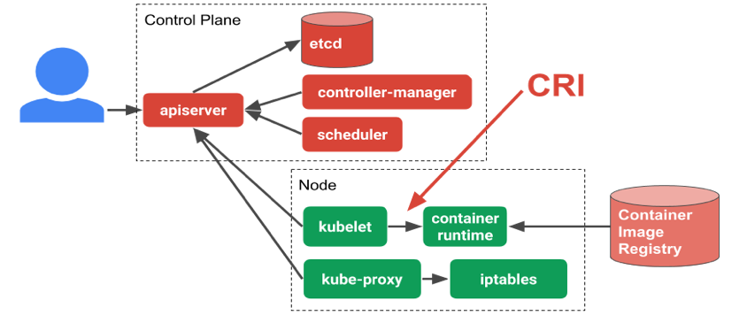
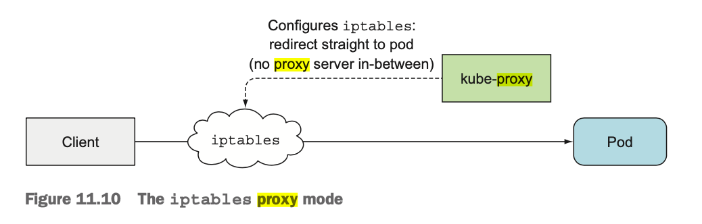

# Kubernetes Cluster Architecture

## Remember the promises

As described in the previous section, the expected feature of a containerised microservices orchestrator:

- scalability
- isolation (custom management for each MS)
- loose coupling
- reduced complexity (less hardware, storage, networking issues)
- seamless rollout and rollbacks
- self-healing : automatically replaces and reschedules containers from failed nodes
- service discovery and load balancing

In addition to that, k8s is the current market leader also for the following reasons:

- k8s is open source and has a massive and very active community
- k8s can work with different container runtime
- k8s cluster federation (ability to group machines within a shared network) is better than its competitor
  - it can be deployed on premises
  - can be deployed on IAAS on any cloud provider

## Contents
- [Kubernetes Cluster Architecture](#kubernetes-cluster-architecture)
  - [Remember the promises](#remember-the-promises)
  - [Contents](#contents)
  - [Master Node](#master-node)
    - [Api Server](#api-server)
    - [ETCD](#etcd)
    - [Scheduler](#scheduler)
    - [Controller Manager](#controller-manager)
      - [Concept Of Resources](#concept-of-resources)
      - [Concept of WATCH mechanism](#concept-of-watch-mechanism)
      - [Concept of Reconciliation](#concept-of-reconciliation)
  - [Minions Node](#minions-node)
    - [Kubelet](#kubelet)
    - [Container Runtime](#container-runtime)
    - [Kube-proxy](#kube-proxy)
  - [Workload resource controllers](#workload-resource-controllers)
    - [Pods](#pods)
      - [Controllers Missions](#controllers-missions)
      - [Examples of Workload Resources](#examples-of-workload-resources)
  - [NETWORKING](#networking)
    - [Docker Networking](#docker-networking)
      - [Bridge](#bridge)
      - [Overlay](#overlay)
    - [Kubernetes networking](#kubernetes-networking)
      - [Kubernetes overlay network](#kubernetes-overlay-network)
      - [Services](#services)
      - [Kube proxy](#kube-proxy-1)
      - [Kube dns](#kube-dns)
  - [Namespaces](#namespaces)
    - [set namespace for a request](#set-namespace-for-a-request)
    - [set namespace for a request](#set-namespace-for-a-request-1)
  - [Service Accounts](#service-accounts)
    - [Definition](#definition)
      - [can-i method to check if SA has some rights](#can-i-method-to-check-if-sa-has-some-rights)
  - [RBAC](#rbac)


**The components we're going to describe in this section are all part of KUBE-SYSTEM NAMESPACE**


## Master Node

Kubernetes has a classic architecture we often observe in Big Data for scalable, redundant and fault tolerant systems:
- Master - Slave: master node acts just as a controller, which coordinates and load balances the workload among the slaves. Containerized Applications do not run on Master, only on slaves but Master orchestrate background operations that are necessary to provide the demanded features such as fault tolerance, scalability, slef healing ....
- Distributed: workload handled in parallel

The Kubernetes master is responsible for maintaining the desired state for the cluster, and it is the brain behind all operations inside the cluster.



It takes care of
- health checking other nodes
- deciding how best to split up
- assign work (known as “scheduling”)
- orchestrating communication between other components.

In k8s, every component is run as a pod.

The **Kubelet** is the **only component** that always **runs as a regular system component**, and it’s the Kubelet that then **runs all the other components as pods**.
To run the Control Plane components as pods, the Kubelet is also deployed on the master.
The next listing shows pods in the kube-system namespace.

`kubectl get componentstatuses`

```bash
NAME                 STATUS    MESSAGE             ERROR
scheduler            Healthy   ok
controller-manager   Healthy   ok
etcd-0               Healthy   {"health":"true"}
```

Kubernetes components running as pods:

`kubectl get po -o custom-columns=POD:metadata.name,NODE:spec.nodeName --sort-by spec.nodeName -n kube-system`

```bash
POD                                         NODE
coredns-6955765f44-dzr5w                    minikube
coredns-6955765f44-q66nc                    minikube
etcd-minikube                               minikube
kube-addon-manager-minikube                 minikube
kube-apiserver-minikube                     minikube
kube-controller-manager-minikube            minikube
kube-proxy-d9vbc                            minikube
kube-scheduler-minikube                     minikube
nginx-ingress-controller-6fc5bcc8c9-95kfd   minikube
storage-provisioner                         minikube
```

> As shown in the listing, you can tell kubectl to display custom columns with the -o custom-columns option and sort the resource list with --sort-by

on a proper k8s cluster you'll see those components :


The Control Plane is what **controls** and **makes** the whole **cluster function**.

These components **store and manage the state of the cluster**, but they **DO NOT RUN**  the **application containers**.


### Api Server

All the administrative tasks are coordinated by the kube-apiserver.
Kubernetes **system components communicate only with the API server**.
They don’t talk to each other directly.

The API server is the **only master plane component to talk to the etcd data store**, both to read and to save Kubernetes cluster state information from/to it.
None of the other components communicate with etcd directly, but instead modify the cluster state by talking to the API server.

The API server is the **gateway to the Kubernetes cluster** (for admin tasks, NOT for applications).

It is the central touch point that is accessed by all users, automation, and components in the Kubernetes cluster.
The API server implements a RESTful API over HTTP, performs all API operations, and is responsible for storing API objects into a persistent storage backend


In addition to providing a consistent way of storing objects in etcd, it also performs validation of those objects, so clients can’t store improperly configured objects (which they could if they were writing to the store directly).

**How API server notifies its clients**

All it does is **enable those controllers and other components** to **observe changes to deployed resources**.
A Control Plane component can **request to be notified when a resource is created, modified, or deleted**.
This enables the component to perform whatever task it needs in response to a change of the cluster metadata.

Clients **watch** for changes by opening an HTTP connection to the API server.
Through this connection, the client will then receive a **stream of modifications** to the ***watched objects***.
Every time an object is updated, the server sends the new version of the object to all connected clients watching the object.


 Figure above shows how **clients can watch for changes to pods** and **how a change** to one of the **pods** is **stored into etcd** and then **relayed to all clients watching pods** at that moment.

> Example of clients that subscribe to this mechanism are Deployment Controllers, Replicaset Controllers...
> kubectl can be one of those clients. If you perform the following command, you'll be notified of each creation, modification, or deletion of a pod, as shown in the following listing. This is like subscribing to a "queue" that will send you messages everytime producer sends a new message

` kubectl get pods -- watch `

### ETCD

All the objects you’ve created, ReplicationControllers, Services, Secrets, and so on need to be stored somewhere in a persistent manner so their manifests survive API server restarts and failures. For this, Kubernetes uses etcd

Etcd is a strongly consistent, distributed key-value store that provides a reliable way to store data that needs to be accessed by a distributed system or cluster of machines.

It keeps valuable information regarding the cluster state (for instance a new pod is launched, its ip address is kept in ETCD)

### Scheduler

The role of the kube-scheduler is to **assign new objects**, such as pods, **to nodes**.
During the scheduling process, decisions are made based on current Kubernetes cluster state and new object's requirements.
The scheduler obtains from etcd, via the API server (since it’s the only component to talk to the etcd), **resource usage data for each worker node** in the cluster.
Based on that, scheduler will assign the Pod to a Node.
**scheduler doesn’t create the pod but assigns it to a node** - user/controller creates the pod.


### Controller Manager

In robotics and automation, a control loop is a non-terminating loop that regulates the state of a system.
Here is one example of a control loop: a thermostat in a room.
When you set the temperature, that’s telling the thermostat about your desired state. The actual room temperature is the current state.
The thermostat acts to bring the current state closer to the desired state, by turning equipment on or off.

#### Concept Of Resources

Instances of Kubernetes objects are called `Resources`.

Resources which ***run containers*** are referred to as `Workloads Resources`. Some examples:

| Workload Resources        | Resources    |
| -----------------------  | ----------|
|  Deployment             | Namespace  |
| Replicaset              | Service|
 Daemonset                 | Endpoints|
 Staefulsets                 | Service Account|
 ...                 | ...|

Users work with Resource APIs by declaring them in files which are then Applied to a Kubernetes cluster. These declarative files are called `Resource Config`. Resource Config is Applied (declarative Create/Update/Delete) to a Kubernetes cluster using tools such as Kubectl, and then ***actuated*** by a `Controller`.

Resources are ***uniquely identified***:

```yaml
apiVersion: (API Type Group and Version)
kind: (API Type Name)
metadata:
  namespace: (Instance namespace)
  name: (Instance name)
```

The Resource Config is therefore a specification about a kubernetes object.
Once applied to the kubernetes cluster, the management of this object is handled by a `controller` that will

- create (or ask the API server to create) the resource
- monitor this resource
in such a way that the current state of the cluster stays as close as possible to the desired state, namely that the state of this specific resource remains in line with what was defined in the Resource COnfig file (the yaml files).

#### Concept of WATCH mechanism


In Kubernetes, controllers are **control loops** that

- **watch the state of your cluster**
- then make or request **changes where needed**.

Each controller tries to **move the current cluster state closer to the desired state**.
This control loop consist of

- connecting to the API server through the **watch mechanism**,
- asks to be **notified** when a **change occurs** in the list of **resources** of any type the controller is **responsible for**.


The controller might carry the action out itself; more commonly, in Kubernetes, a controller will send messages to the API server that have useful side effects. You’ll see examples of this below.

#### Concept of Reconciliation

Controllers actuate Resources by reading the Resource they are Reconciling + related Resources, such as those that they create and delete.

Controllers do not Reconcile events, rather they Reconcile the expected cluster state to the observed cluster state at the time Reconcile is run.

Because Controllers don't respond to individual Events, but instead Reconcile the state of the system at the time that Reconcile is run, changes from several different events may be observed and Reconciled together. This is referred to as a Level Based system, whereas a system that responds to each event individually would be referred to as an Edge Based system.

## Minions Node

### Kubelet

In contrast to all the controllers, which are part of the Kubernetes Control Plane and run on the master node(s), the Kubelet and the Service Proxy both run on the **worker nodes**, where the **actual pods containers run**.

The Kubelet is the **component responsible for everything running on a worker node**.
Its initial job is to register the node it’s running on by creating a Node resource in the API server.

Then it needs to **continuously**

- **monitor** the **API server for Pods that have been scheduled to the node**
- **start the pod’s containers**.

It does this by telling the configured container runtime to run a container from a specific container image.

The Kubelet then constantly

- monitors running containers
- reports their status, events, and resource consumption to the API server.

The Kubelet is also the component that **runs the container liveness probes**, restarting containers when the probes fail. Lastly, it terminates containers when their Pod is deleted from the API server and notifies the server that the pod has terminated.


- One kubelet per worker node (per VM)
- Point of contact between the Master and the worker
- Master Node send commands and work to kubelet
- Kubelet assumes responsibility for maintaining the state of the work on the node server
- Kubelet controls the container runtime to launch or destroy containers as needed (Kubelet runs the PODS!!!)

### Container Runtime

The first component that each node must have is a container runtime inteface, `CRI`.
Typically, this requirement is satisfied by installing and running `Docker Engine` also know as `Docker Daemon`, but alternatives like `rkt` and `runc` are also available.
The container runtime is responsible for starting and managing ***containers***, applications encapsulated in a relatively isolated but lightweight operating environment.
Each unit of work on the cluster is, at its basic level, implemented as one or more containers that must be deployed.
The container runtime on each node is the component that **finally runs the containers defined in the workloads** submitted to the cluster

### Kube-proxy

Network agent which runs on each node responsible for dynamic updates and maintenance of all networking rules on the node:

- forwards requests to the correct containers with primitive load balancing
- responsible for making sure the networking environment is predictable and accessible, but isolated where appropriate

## Workload resource controllers

`Workload Resources` are objects that **manage set of Pods** on your behalf. These resources **configure controllers** that make sure the right number of the right kind of Pod are running, to match the state you specified in the `Resource Config` files.

We find 9 workload resources controllers that have the ability to manager/create pods.


Let's quickly go through a definition of what is a pod before going over workload resources controllers.

### Pods

A Pod is the **smallest and simplest Kubernetes object**.
It is the unit of deployment in Kubernetes, which represents a **single instance of the application**.

A Pod is a **logical collection of one or more containers** that encapsulates

- **storage resources**
- **unique network identity (IP address)**
- options that govern how the container(s) should run.


```yaml
apiVersion: v1
kind: Pod
metadata:
  name: memory-demo
  namespace: mem-example
spec:
  containers:
  - name: memory-demo-ctr
    image: polinux/stress
    resources:
      limits:
        memory: "200Mi"
      requests:
        memory: "100Mi"
    command: ["stress"]
    args: ["--vm", "1", "--vm-bytes", "150M", "--vm-hang", "1"]
```

Remember the revolution of switching from monolith to microservices paradigm.

In itself, a pod is an

- isolated: own runtime, resources, dependencies...
- loosely coupled
  - to hardware/system
  - between other services

However we saw in the previous chapter that a few additionnal capabilities are expected from containers orchestrators.
This is where the controllers come into action.


#### Controllers Missions

Pods are **transient** (ephemeral in nature), and they do **not have** the capability to **self-heal by themselves**.
Those features are achieved through objects, `Workload Resources`, and their associated ***controller***. We provide manifests where we indicate

- specification about the resource they have to manage (nb of Replica, cronjob,end points)
- podTemplate - description of the container (image, volume, port,...)

That is the **reason they are used with controllers** which handle Pods'

- **replication**
- fault tolerance
- self-healing
- **scalability**
- **seamless updates/upgrades or rollbacks**

***Controllers*** act as agent that  use the **watch** mechanism to be **notified by the API server of each change** that may affect the **desired state of the resources in their scope**. In case of mismatch between desired and observed state. They take action to bring current state as close as possible to desired.

Controllers for workload resources **create Pods from a pod template** and manage those Pods on your behalf.
**PodTemplates** are **specifications for creating Pods**, and are **included in workload resources**
The PodTemplate is **part of the desired state** of whatever workload resource you used to run your app.

These objects (Deployments, ReplicaSets, Jobs,..) have a **spec field** that, combined with the content of the PodTemplate section, represents the **desired state**.
The **controller(s) for that resource** are **responsible** for **making** the **current state** come **closer** to that **desired state**.

They use the **watch** mechanism to be **notified by the API server of each change** that may affect the **desired state of the resources in their scope** :arrow-right:  the Resource they have to actuate, monitor and manage.

They **make sure** the **kubelet on a set of Nodes are running the right number of Pods** to get the work done

If a **mismatch** between desired and current state happens, for instance a pod fails and therefore the current number of running pods is below the desired number, the **controller** (for instance ReplicaSet Controller):

- **creates new Pod manifest**
- **posts** it to the **API server**
- **lets** the **Scheduler** assigns the new defined resource (Pod) to a worker node  
- **lets** the **Kubelet** on this node **runs** the pod and its container(s)

The example below shows the sequence of creating a new deployment.


As we can see, controllers are responsible for either creating pods (RS controller here) or notifying the Master that a pod needs to be created (Deployment Controller).
You can also notice that every objects in this sequence diagram ALWAYS interacts with other objects through the API server.

The only exception is between kubelet and pods (since kubelet is located on worker node as well as pods)

They **create Pod resources from the pod template defined in their respective resources**.
These controllers **don’t run the pods**, but

- **post Pod definitions to the API server**
- **let the Kubelet create their containers and run them**.

Controllers also update the objects that configure them. For example: once the work is done for a Job, the Job controller updates that Job object to mark it Finished.

#### Examples of Workload Resources

The sample below is a manifest for a simple Job with a template that starts one container.
The container in that Pod prints a message then pauses.

```yaml
apiVersion: batch/v1
kind: Job
metadata:
  name: hello
spec:
  template:
    # This is the pod template
    spec:
      containers:
      - name: hello
        image: busybox
        command: ['sh', '-c', 'echo "Hello, Kubernetes!" && sleep 3600']
      restartPolicy: OnFailure
    # The pod template ends here
```

Modifying the pod template or switching to a new pod template has no effect on the Pods that already exist.
Pods do not receive template updates directly; instead, a new Pod is created to match the revised pod template.


For example, a Deployment controller ensures that the running Pods match the current pod template.
If the template is updated, the controller has to remove the existing Pods and create new Pods based on the updated template. Each workload controller implements its own rules for handling changes to the Pod template.

## NETWORKING


### Docker Networking

One of the reasons Docker containers and services are so powerful is that you can connect them together, or connect them to non-Docker workloads. Docker containers and services do not even need to be aware that they are deployed on Docker, or whether their peers are also Docker workloads or not. Whether your Docker hosts run Linux, Windows, or a mix of the two, you can use Docker to manage them in a platform-agnostic way.
There are several network drivers: bridge, host, overlay, macvlan.
In this kubernetes training, we'll quickly go through the most common (and basic) driver, `Bridge`, as well as the `overlay network`, which is what kubernetes achieves to ***enable containers running on different docker daemon hosts to communicate together***.

#### Bridge

**Network Bridge**
A network bridge is a device that can create a ***single network from different and multiple network segments***. In other words, it can connect the two or more networks. The function used here is called Network Bridging.

There is a difference between bridging and routing. In routing, there are more than one networks which run independently but they can communicate with one another. However, in the bridging, the concept is totally different. Here, the two networks are bridged together in order to work as one single network.

**Docker Bridge**

The docker0 bridge is the heart of default networking.
When the Docker service is started, a Linux bridge is created on the host machine. The interfaces on the containers talk to the bridge, and the bridge proxies to the external world. Multiple containers on the same host can talk to each other through the Linux bridge.


In terms of networking, a bridge network is a Link Layer device which forwards traffic between network segments. A bridge can be a hardware device or a software device running within a host machine’s kernel.

In terms of Docker, a bridge network uses a software bridge which

- allows containers connected to the same bridge network to communicate,
- while providing isolation from containers which are not connected to that bridge network.

The Docker bridge driver automatically installs rules in the host machine so that containers on different bridge networks cannot communicate directly with each other.

Bridge networks apply to containers running on the ***same Docker daemon host***.
For communication among containers running on different Docker daemon hosts, you can either manage routing at the OS level, or you can use an `overlay network`.

When you start Docker, a default bridge network (also called bridge) is created automatically, and newly-started containers connect to it unless otherwise specified. You can also create user-defined custom bridge networks.
See command to list and inspect the network bridges

> docker network ls

```bash
NETWORK ID          NAME                    DRIVER              SCOPE
6ef5b2799501        bridge                  bridge              local
01614523403a        datalake-api_default    bridge              local
53d1604a8d36        docker-image_default    bridge              local
6079483af1b4        example_default         bridge              local
74faadd8bee3        host                    host                local
68b182f9890c        jjwebapp_default        bridge              local
df58b1823493        mvc_seq_default         bridge              local
d75da5005a76        mvc_seq_real_default    bridge              local
29e77466c643        mvc_seq_views_default   bridge              local
f765b2b3cf36        node-app_default        bridge              local
6086d437edbd        nodewebapp_default      bridge              local
a5686146bc9f        none                    null                local
e6e8835e8482        sequelizetest_default   bridge              local
fca927858ec4        voucherwebapp_default   bridge              local
```

> docker network inspect datalake-api_default

```json
[
    {
        "Name": "datalake-api_default",
        "Id": "01614523403adb9a7f8f3baa338d6a94aab89ac842328e8fa46120fc27a130e2",
        "Created": "2020-08-03T18:12:24.841252466Z",
        "Scope": "local",
        "Driver": "bridge",
        "EnableIPv6": false,
        "IPAM": {
            "Driver": "default",
            "Options": null,
            "Config": [
                {
                    "Subnet": "172.28.0.0/16",
                    "Gateway": "172.28.0.1"
                }
            ]
        },
        "Internal": false,
        "Attachable": true,
        "Ingress": false,
        "ConfigFrom": {
            "Network": ""
        },
        "ConfigOnly": false,
        "Containers": {},
        "Options": {},
        "Labels": {
            "com.docker.compose.network": "default",
            "com.docker.compose.project": "datalake-api",
            "com.docker.compose.version": "1.26.2"
        }
    }
]
```

User-defined bridge networks are superior to the default bridge network:

- User-defined bridges provide automatic DNS resolution between containers
- User-defined bridges provide better isolation:
  - All containers without a `--network`  specified, are attached to the default bridge network. This can be a risk, as unrelated stacks/services/containers are then able to communicate.
  - Using a user-defined network provides a scoped network in which only containers attached to that network are able to communicate.

#### Overlay

Overlay networks connect multiple Docker daemons together and enable swarm services to communicate with each other.
The overlay network driver creates a distributed network among multiple Docker daemon hosts.
This network sits on top of (overlays) the host-specific networks, allowing containers connected to it (including swarm service containers) to communicate securely when encryption is enabled.
Docker transparently handles routing of each packet to and from the correct Docker daemon host and the correct destination container.

When you initialize a swarm or join a Docker host to an existing swarm, two new networks are created on that Docker host:

- an overlay network called ingress, which handles control and data traffic related to swarm services.
- a bridge network called docker_gwbridge, which connects the individual Docker daemon to the other daemons participating in the swarm.

Here's a link that goes deeper in details:

https://matthewpalmer.net/kubernetes-app-developer/articles/kubernetes-networking-guide-beginners.html

### Kubernetes networking


In K8S, there are networking challenges. Decoupled microservices based applications rely heavily on networking in order to mimic the tight-coupling once available in the monolithic era. Kubernetes - as a containerized microservices orchestrator is needs to address 4 distinct networking challenges:


-	<u>Pod to Pod communication</u>: The Kubernetes network model aims to reduce complexity, and it treats Pods as VMs on a network, where each VM receives an IP address - thus each Pod receiving an IP address. This model is called **"IP-per-Pod"** and ensures Pod-to-Pod communication, just as VMs are able to communicate with each other. Let's not forget about containers though. They share the Pod's network namespace and must coordinate ports assignment inside the Pod just as applications would on a VM, all while being able to communicate with each other on localhost - inside the Pod.

-	<u>Pod to Services</u>: complex constructs which encapsulate networking rules definitions on cluster nodes and stored in kube-proxy's iptables. Pods, based on labels selector, are bound to specific Service (virtual IP) that reverse proxy traffic to its pods (final end points)

-	<u>External-to-Service communication</u>: By exposing services (NodePort, LB, Ingress) to the external world with kube-proxy, applications become accessible from outside the cluster over a virtual IP.

-	<u>Container-to-container communication inside same Pod</u>: via localhost (They share same network namespace)


#### Kubernetes overlay network

Kubernetes manages networking through Container Network Interface.
This is pretty similar to Docker swarm:

- Pods on a node are connected to the same bridge through virtual Ethernet interface pairs.

- an overlay network enables communication between nodes (between pods across different nodes) using network plugins like FLannel, Calico, Azure CNI ... :  a network agent is deployed through a Daemonset (one agent per node)


#### Services

Even though we saw in the networking section that "Ip Per Pod"  model ensures that any pod can communicate with an other, Kubernetes Pods are mortal. They are born and when they die, they are not resurrected.

It means it is impossible to keep track of which IP address to connect to.

The sustainable solution to make sure that your microservices can communicate is called the service, another k8s resource.

A Service is an abstraction which defines
- a logical set of Pods determined by a selector (except 1 type of svc)
- a policy by which to access them (Protocol, port(s)...)

Basicaly, a service consists of
- a static virtual ip (cluster ip)
- while this logical set of pods makes up the real Endpoints of this virtual ip
- policy to get in touch with its endpoints (backed pods)

The IP address is virtual—it’s not assigned to any network interfaces and is never listed as either the source or the destination IP address in a network packet.
A key detail of Services is that they consist of an IP and port pair (or multiple IP and port pairs in the case of multi-port Services), so the service IP by itself doesn’t represent anything. **That’s why you can’t ping them.**


#### Kube proxy

Everything related to Services is handled by the kube-proxy process **running on each node**.

Initially, the kube-proxy was an actual proxy waiting for connections and for each incoming connection, opening a new connection to one of the pods. This was called the userspace proxy mode.


Later, a better-performing iptables proxy mode replaced it. This is now the default, but you can still configure Kubernetes to use the old mode if you want.



When a service is created in the API server, the virtual IP address is assigned to it immediately.
Soon afterward, the API server **notifies all kube-proxy agents running on the worker nodes** that a **new Service has been created.**

Each kube-proxy makes that service addressable on its node by setting up **iptables rules,** which make sure
- each packet destined for the **service IP/port** pair is **intercepted**
- its **destination address modified**, so the packet is redirected to one of the pods backing the service.

Besides **watching** the **API server for changes to Services,** kube-proxy also watches for **changes to Endpoints objects.**
An Endpoints object holds the IP/port pairs of all the pods that back the service (an IP/port pair can also point to something other than a pod).
That’s why the kube-proxy must also watch all Endpoints objects.
After all, an Endpoints object changes every time a new backing pod is created or deleted, and when the pod’s readiness status changes or the pod’s labels change and it falls in or out of scope of the service.

Now let’s see how kube-proxy enables clients to connect to those pods through the Service.
The figure shows what the kube-proxy does and how a packet sent by a client pod reaches one of the pods backing the Service. Let’s examine what happens to the packet when it’s sent by the client pod (pod A in the figure).


The **packet’s destination is initially set to the IP and port of the Service** (in the example, the Service is at 172.30.0.1:80).
Before being sent to the network, packet is first handled by node A’s kernel according to the **iptables rules** set up on the node.
The kernel checks if the packet matches any of those iptables rules.
One of them says that if any packet has the destination IP equal to 172.30.0.1 and destination port equal to 80, the **packet’s destination IP and port should be replaced with the IP and port of a randomly selected pod**.

The packet in the example matches that rule and so its destination IP/port is changed. In the example, pod B2 was randomly selected, so the packet’s destination IP is changed to 10.1.2.1 (pod B2’s IP) and the port to 8080 (the target port specified in the Service spec). From here on, it’s exactly as if the client pod had sent the packet to pod B directly instead of through the service.

> sudo iptables-save | grep simpleservice

#### Kube dns

Services will not only make kube-proxy create rules to route traffic; it will also trigger something called kube-dns.

Kube-dns is a set of pods with SkyDNS containers that run on the cluster that provides a DNS server and forwarder, which will create records for services.
Whenever you create a service, a **DNS record pointing to the service's internal cluster IP address** will be created with the form **service-name.namespace.svc.cluster.local**.
This the Fully Qualified Domain Name (FQDN).

If DNS has been enabled throughout your cluster then all Pods should automatically be able to resolve Services by their DNS name.

If a request is made to a **service VIP using its FQDN**, the **request coming to kube-proxy is resolved using DNS pod**.


## Namespaces

Kubernetes supports multiple virtual clusters backed by the same physical cluster. These virtual clusters are called namespaces.

Namespaces provide a scope for names. Names of resources need to be unique within a namespace, but not across namespaces. Namespaces can not be nested inside one another and each Kubernetes resource can only be in one namespace.

### set namespace for a request

`kubectl run nginx --image=nginx --namespace=<insert-namespace-name-here>`
`kubectl get pods --namespace=<insert-namespace-name-here>`

### set namespace for a request
> kubectl config set-context --current --namespace=<insert-namespace-name-here>
> kubectl config view --minify | grep namespace:


## Service Accounts
https://thenewstack.io/kubernetes-access-control-exploring-service-accounts/

### Definition

In Kubernetes, service accounts are used to provide an identity for pods. Pods that want to interact with the API server will authenticate with a particular service account. By default, applications will authenticate as the default service account in the namespace they are running in. This means, for example, that an application running in the test namespace will use the default service account of the test namespace.


https://dzone.com/articles/using-rbac-with-service-accounts-in-kubernetes

```yaml
kubectl get -o yaml pod veering-sheep-nginx-ingress-controller-6c8c486dd7-mw7s4 -n kube-system

kubectl get sa veering-sheep-nginx-ingress -n kube-system -o yaml

kubectl get rolebindings,clusterrolebindings \
--all-namespaces  \
-o custom-columns='KIND:kind,NAMESPACE:metadata.namespace,NAME:metadata.name,SERVICE_ACCOUNTS:subjects[?(@.kind=="ServiceAccount")].name'

kubectl get  rolebinding --output=yaml -n kube-system
```

svcAcc=heapster
rbac-lookup $svcAcc  -k serviceaccount -o wide

https://kubernetes.io/docs/reference/access-authn-authz/service-accounts-admin/


#### can-i method to check if SA has some rights

https://stackoverflow.com/questions/54889458/kubernetes-check-serviceaccount-permissions
ns=default
svcAcc=default
verb=get
resource=pods
kubectl auth can-i <verb> <resource> --as=system:serviceaccount:<namespace>:<serviceaccountname> [-n <namespace>]
kubectl auth can-i $verb $resource --as=system:serviceaccount:$ns:$svcAcc -n $ns


## RBAC


top exos
https://www.howtoforge.com/role-based-access-control-rbac-in-kubernetes/


**[              back to ingress home:arrow_left:](README.md)**
**[:arrow_right:               next section core components](core-comp.md)**
