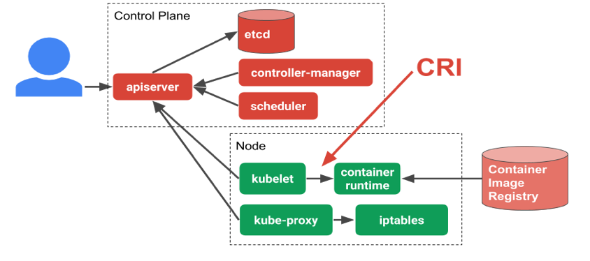
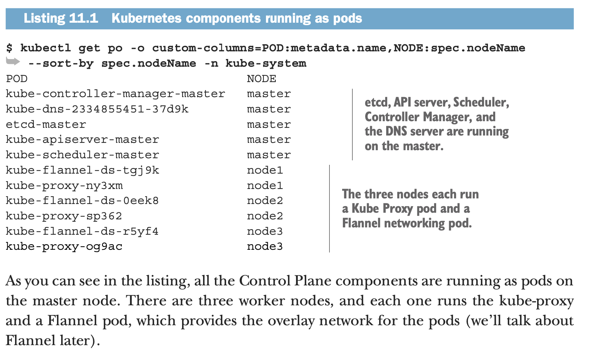
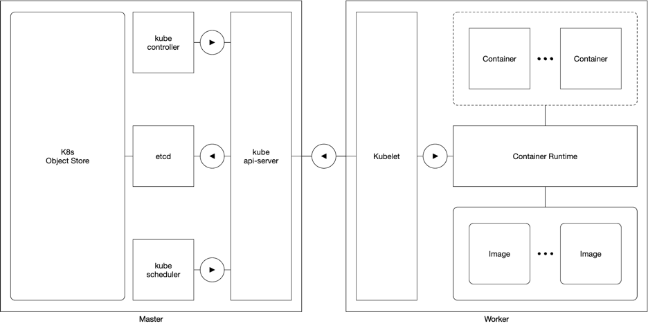
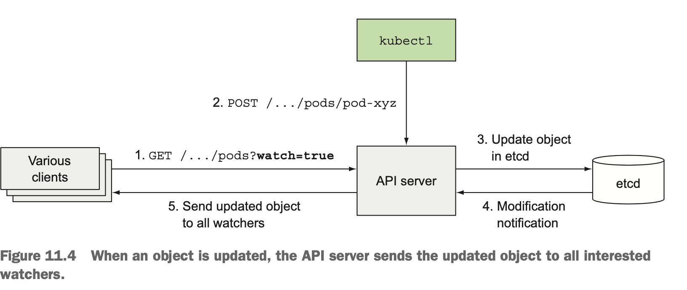
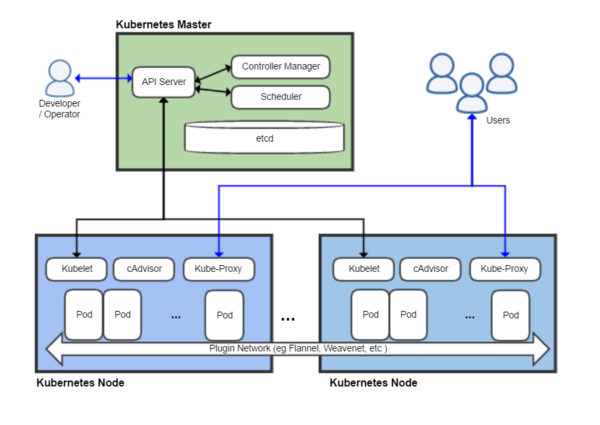
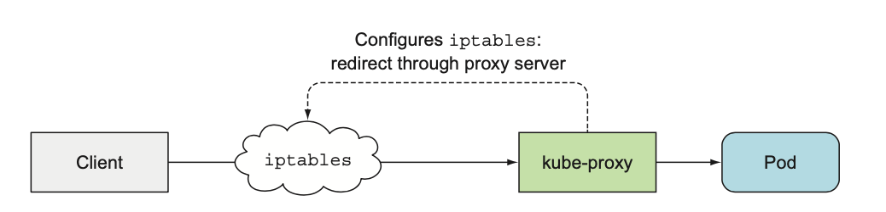
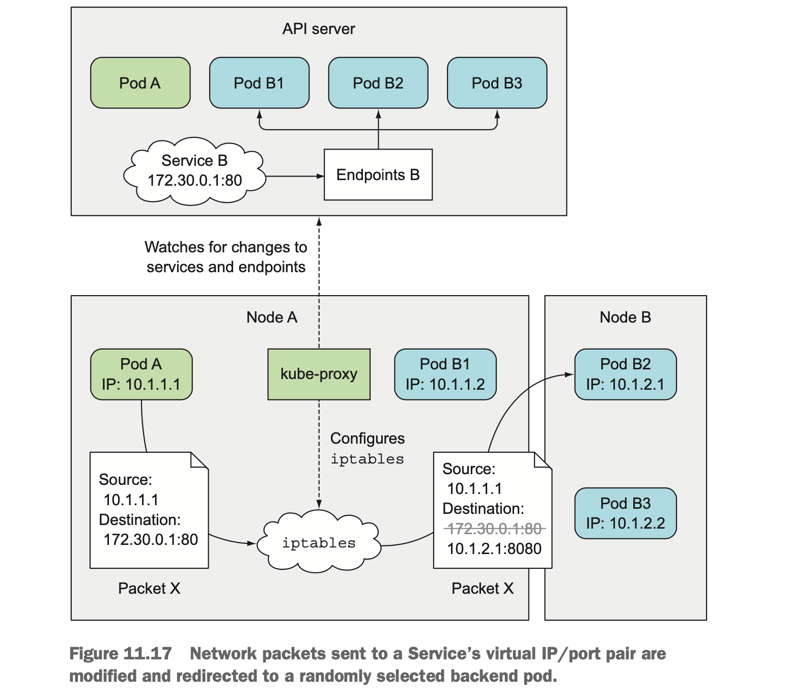
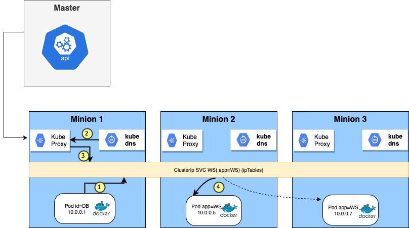

# Global Architecture

As described in the previous section, the expected feature of a containerised microservices orchestrator:

- scalability
- isolation (custom management for each MS)
- loose coupling
- reduced complexity (less hardware, storage, networking issues)
- seamless rollout and rollbacks
- self-healing : automatically replaces and reschedules containers from failed nodes
- service discovery and load balancing

In addition to that, k8s is the current market leader also for the following reasons:

- k8s is open source and has a massive and very active community
- k8s can work with different container runtime
- k8s cluster federation (ability to group machines within a shared network) is better than its competitor
  - it can be deployed on premises
  - can be deployed on IAAS on any cloud provider

TODO add namespace section

## Contents
* [Master Node (Control Plane)](#master-node)
  * [Api Server](#api-server)
  * [ETCD](#etcd)
  * [Scheduler](#scheduler)
  * [Controller Manager](#controller-manager)
* [Minions Node (Worker)](#minions-node)
  * [Kubelet](#kubelet)
  * [Container Runtime](#container-runtime)
  * [Kube-proxy](#kube-proxy)
* [Workload resource controllers](#workload-resource-controllers)
  * [Pods overview](#pods)
  * [Added Values of Controllers](#added-values-of-controllers)
* [Networking](#Networking)
  * [overview](#overview)
  * [services](#services)
  * [Kube Proxy](#kube-proxy)
  * [Kube DNS](#kube-dns)
* [Namespaces](#namespaces)


**The components we're going to describe in this section are all part of KUBE-SYSTEM NAMESPACE**


## Master Node

The Kubernetes master is responsible for maintaining the desired state for the cluster, and it is the brain behind all operations inside the cluster.



It takes care of
- health checking other nodes
- deciding how best to split up
- assign work (known as “scheduling”)
- orchestrating communication between other components.

In k8s, every component is run as a pod.

The **Kubelet** is the **only component** that always **runs as a regular system component**, and it’s the Kubelet that then **runs all the other components as pods**.
To run the Control Plane components as pods, the Kubelet is also deployed on the master.
The next listing shows pods in the kube-system namespace.

`kubectl get componentstatuses`

```
NAME                 STATUS    MESSAGE             ERROR
scheduler            Healthy   ok
controller-manager   Healthy   ok
etcd-0               Healthy   {"health":"true"}
```

Kubernetes components running as pods:
`kubectl get po -o custom-columns=POD:metadata.name,NODE:spec.nodeName --sort-by spec.nodeName -n kube-system`


```
POD                                         NODE
coredns-6955765f44-dzr5w                    minikube
coredns-6955765f44-q66nc                    minikube
etcd-minikube                               minikube
kube-addon-manager-minikube                 minikube
kube-apiserver-minikube                     minikube
kube-controller-manager-minikube            minikube
kube-proxy-d9vbc                            minikube
kube-scheduler-minikube                     minikube
nginx-ingress-controller-6fc5bcc8c9-95kfd   minikube
storage-provisioner                         minikube
```
> As shown in the listing, you can tell kubectl to display custom columns with the -o custom-columns option and sort the resource list with --sort-by

on a proper k8s cluster you'll see those components :



The Control Plane is what **controls** and **makes** the whole **cluster function**.

These components **store and manage the state of the cluster**, but they **DO NO RUN**  the **application containers**.


###     Api Server


All the administrative tasks are coordinated by the kube-apiserver.
Kubernetes **system components communicate only with the API server**.
They don’t talk to each other directly.

The API server is the **only master plane component to talk to the etcd data store**, both to read and to save Kubernetes cluster state information from/to it.
None of the other components communicate with etcd directly, but instead modify the cluster state by talking to the API server.

The API server is the **gateway to the Kubernetes cluster** (for admin tasks, NOT for applications).

It is the central touch point that is accessed by all users, automation, and components in the Kubernetes cluster.
The API server implements a RESTful API over HTTP, performs all API operations, and is responsible for storing API objects into a persistent storage backend



In addition to providing a consistent way of storing objects in etcd, it also performs validation of those objects, so clients can’t store improperly configured objects (which they could if they were writing to the store directly).

**How API server notifies its clients**


All it does is **enable those controllers and other components** to **observe changes to deployed resources**.
A Control Plane component can **request to be notified when a resource is created, modified, or deleted**.
This enables the component to perform whatever task it needs in response to a change of the cluster metadata.

Clients **watch** for changes by opening an HTTP connection to the API server.
Through this connection, the client will then receive a stream of modifications to the watched objects.
Every time an object is updated, the server sends the new version of the object to all connected clients watching the object.


 Figure above shows how **clients can watch for changes to pods** and **how a change** to one of the **pods** is **stored into etcd** and then **relayed to all clients watching pods** at that moment.

> kubectl can be one of those clients. If you perform the following command, you'll be notified of each creation, modification, or deletion of a pod, as shown in the following listing. This is like subscribing to a "queue" that will send you messages everytime producer sends a new message

` kubectl get pods -- watch `


###   ETCD

All the objects you’ve created, ReplicationControllers, Services, Secrets, and so on need to be stored somewhere in a persistent manner so their manifests survive API server restarts and failures. For this, Kubernetes uses etcd

Etcd is a strongly consistent, distributed key-value store that provides a reliable way to store data that needs to be accessed by a distributed system or cluster of machines.

It keeps valuable information regarding the cluster state (for instance a new pod is launched, its ip address is kept in ETCD)

###   Scheduler

The role of the kube-scheduler is to **assign new objects**, such as pods, **to nodes**.
During the scheduling process, decisions are made based on current Kubernetes cluster state and new object's requirements.
The scheduler obtains from etcd, via the API server (since it’s the only component to talk to the etcd), **resource usage data for each worker node** in the cluster.
Based on that, scheduler will assign the Pod to a Node.
**scheduler doesn’t create the pod but assigns it to a node** - user/controller creates the pod.


###   Controller Manager

In robotics and automation, a control loop is a non-terminating loop that regulates the state of a system.
Here is one example of a control loop: a thermostat in a room.
When you set the temperature, that’s telling the thermostat about your desired state. The actual room temperature is the current state.
The thermostat acts to bring the current state closer to the desired state, by turning equipment on or off.

#### Control Loop through "WATCH" mechanism

In Kubernetes, controllers are **control loops** that
- **watch the state of your cluster**
- then make or request **changes where needed**.

Each controller tries to **move the current cluster state closer to the desired state**.
This control loop consist of
- connecting to the API server through the **watch mechanism**,
- asks to be **notified** when a **change occurs*** in the list of **resources** of any type the controller is **responsible for**.


The controller might carry the action out itself; more commonly, in Kubernetes, a controller will send messages to the API server that have useful side effects. You’ll see examples of this below.

#### Controllers Missions

There are **different types of controller** in k8s and **each tracks** at least one **Kubernetes resource type**.

They use the **watch** mechanism to be **notified by the API server of each change** that may affect the **desired state of the resources in their scope** (for instance the ReplicaSet Controller checks the number of matched pods).

These objects have a **spec field that represents the desired state**.
The **controller(s) for that resource** are **responsible** for **making** the **current state** come **closer** to that **desired state**.

They **make sure** the **kubelet on a set of Nodes are running the right number of Pods** to get the work done


If a **mismatch** between desired and current state happens, for instance a pod fails and therefore the current number of running pods is below the desired number, the **controller** (for instance ReplicaSet Controller):
- **creates new Pod manifest**
- **posts** it to the **API server**
- **lets** the **Scheduler** assigns the new defined resource (Pod) to a worker node  
- **lets** the **Kubelet** on this node **runs** the pod and its container(s)


The example below shows the sequence of creating a new deployment.

As we can see, controllers are responsible for either creating pods (RS controller here) or notifying the Master that a pod needs to be created (Deployment Controller).
You can also notice that every objects in this sequence diagram ALWAYS interacts with other objects through the API server.

The only exception is between kubelet and pods (since kubelet is located on worker node as well as pods)


They **create Pod resources from the pod template defined in their respective resources**.
These controllers **don’t run the pods**, but
- **post Pod definitions to the API server**
- **let the Kubelet create their containers and run them**.


Controllers also update the objects that configure them. For example: once the work is done for a Job, the Job controller updates that Job object to mark it Finished.


##  Minions Node


###   Kubelet

In contrast to all the controllers, which are part of the Kubernetes Control Plane and run on the master node(s), the Kubelet and the Service Proxy both run on the **worker nodes**, where the **actual pods containers run**.

The Kubelet is the **component responsible for everything running on a worker node**.
Its initial job is to register the node it’s running on by creating a Node resource in the API server.

Then it needs to **continuously**
- **monitor** the **API server for Pods that have been scheduled to the node**
- **start the pod’s containers**.

It does this by telling the configured container runtime to run a container from a specific container image.

The Kubelet then constantly
- monitors running containers
- reports their status, events, and resource consumption to the API server.

The Kubelet is also the component that **runs the container liveness probes**, restarting containers when the probes fail. Lastly, it terminates containers when their Pod is deleted from the API server and notifies the server that the pod has terminated.


- One kubelet per worker node (per VM)
- Point of contact between the Master and the worker
- Master Node send commands and work to kubelet
- Kubelet assumes responsibility for maintaining the state of the work on the node server
- Kubelet controls the container runtime to launch or destroy containers as needed (Kubelet runs the PODS!!!)

###   Container Runtime

The first component that each node must have is a container runtime.
Typically, this requirement is satisfied by installing and running Docker, but alternatives like rkt and runc are also available.
The container runtime is responsible for starting and managing containers, applications encapsulated in a relatively isolated but lightweight operating environment.
Each unit of work on the cluster is, at its basic level, implemented as one or more containers that must be deployed.
The container runtime on each node is the component that finally runs the containers defined in the workloads submitted to the cluster

###   Kube-proxy

- network agent which runs on each node responsible for dynamic updates and maintenance of all networking rules on the node
- forwards requests to the correct containers with primitive load balancing
- responsible for making sure the networking environment is predictable and accessible, but isolated where appropriate


## Workload resource controllers

In this section, we're going to demonstrate the substantial added values controllers bring to kubernetes.
To do so, we will
- quickly go through the **pod** description
- describe the added value of integrating pods into workload resources controllers

### Pods

A Pod is the **smallest and simplest Kubernetes object**.
It is the unit of deployment in Kubernetes, which represents a **single instance of the application**.

A Pod is a **logical collection of one or more containers** that encapsulates
- **storage resources**
- **unique network identity (IP address)**
- options that govern how the container(s) should run.


```
apiVersion: v1
kind: Pod
metadata:
  name: memory-demo
  namespace: mem-example
spec:
  containers:
  - name: memory-demo-ctr
    image: polinux/stress
    resources:
      limits:
        memory: "200Mi"
      requests:
        memory: "100Mi"
    command: ["stress"]
    args: ["--vm", "1", "--vm-bytes", "150M", "--vm-hang", "1"]
```

Remember the revolution of switching from monolith to microservices paradigm.

In itself, a pod is an
- isolated: own runtime, resources, dependencies...
- loosely coupled
  - to hardware/system
  - between other services

However we saw in the previous chapter that a few additionnal apaibilities are expected from containers orchestrators.
This is where the controllers come into action.

### Added Values of Controllers

Pods are **transient** (ephemeral in nature), and they do **not have** the capability to **self-heal by themselves**.

That is the **reason they are used with controllers** which handle Pods'
- **replication**
- fault tolerance
- self-healing
- **scalability**
- **seamless updates/upgrades or rollbacks**


**Controllers for workload resources create Pods from a pod template and manage those Pods on your behalf**.

**PodTemplates** are **specifications for creating Pods**, and are **included in workload resources** such as

- Deployments
- Replicasets
- Statefulsets
- DaemonSets
- Jobs

Each controller for a workload resource uses the **PodTemplate inside the workload object to make actual Pods**.
The PodTemplate is **part of the desired state** of whatever workload resource you used to run your app.

The sample below is a manifest for a simple Job with a template that starts one container.
The container in that Pod prints a message then pauses.

```
apiVersion: batch/v1
kind: Job
metadata:
  name: hello
spec:
  template:
    # This is the pod template
    spec:
      containers:
      - name: hello
        image: busybox
        command: ['sh', '-c', 'echo "Hello, Kubernetes!" && sleep 3600']
      restartPolicy: OnFailure
    # The pod template ends here
```

Modifying the pod template or switching to a new pod template has no effect on the Pods that already exist.
Pods do not receive template updates directly; instead, a new Pod is created to match the revised pod template.

For example, a Deployment controller ensures that the running Pods match the current pod template.
If the template is updated, the controller has to remove the existing Pods and create new Pods based on the updated template. Each workload controller implements its own rules for handling changes to the Pod template.

**Labels**
Workload resource controllers uses labels to match the pods that they will manage
key value pair that qualifies a pod and is used as a selector to define scope of
- Deployments
- Replicasets
- Services


## NETWORKING

We're not going to dive deeper into concepts such as
- bridges
- virtual ethernet devices
- CNI




Here's a link that goes deeper in details:
https://matthewpalmer.net/kubernetes-app-developer/articles/kubernetes-networking-guide-beginners.html

### Overview


In K8S, there are networking challenges. Decoupled microservices based applications rely heavily on networking in order to mimic the tight-coupling once available in the monolithic era. Kubernetes - as a containerized microservices orchestrator is needs to address 4 distinct networking challenges:


-	<u>Pod to Pod communication</u>: The Kubernetes network model aims to reduce complexity, and it treats Pods as VMs on a network, where each VM receives an IP address - thus each Pod receiving an IP address. This model is called **"IP-per-Pod"** and ensures Pod-to-Pod communication, just as VMs are able to communicate with each other. Let's not forget about containers though. They share the Pod's network namespace and must coordinate ports assignment inside the Pod just as applications would on a VM, all while being able to communicate with each other on localhost - inside the Pod.

-	<u>Pod to Services</u>: complex constructs which encapsulate networking rules definitions on cluster nodes and stored in kube-proxy's iptables. Pods, based on labels selector, are bound to specific Service (virtual IP) that reverse proxy traffic to its pods (final end points)

-	<u>External-to-Service communication</u>: By exposing services (NodePort, LB, Ingress) to the external world with kube-proxy, applications become accessible from outside the cluster over a virtual IP.

-	<u>Container-to-container communication inside same Pod</u>: via localhost (They share same network namespace)


### Services

Even though we saw in the networking section that "Ip Per Pod"  model ensures that any pod can communicate with an other, Kubernetes Pods are mortal. They are born and when they die, they are not resurrected.

It means it is impossible to keep track of which IP address to connect to.

The sustainable solution to make sure that your microservices can communicate is called the service, another k8s resource.

A Service is an abstraction which defines
- a logical set of Pods determined by a selector (except 1 type of svc)
- a policy by which to access them

Basicaly, a service consists of
- a static virtual ip (cluster ip)
- while this logical set of pods makes up the real Endpoints of this virtual ip
- policy to get in touch with its endpoints (backed pods)

The IP address is virtual—it’s not assigned to any network interfaces and is never listed as either the source or the destination IP address in a network packet.
A key detail of Services is that they consist of an IP and port pair (or multiple IP and port pairs in the case of multi-port Services), so the service IP by itself doesn’t represent anything. **That’s why you can’t ping them.**


### Kube proxy

Everything related to Services is handled by the kube-proxy process **running on each node**.

Initially, the kube-proxy was an actual proxy waiting for connections and for each incoming connection, opening a new connection to one of the pods. This was called the userspace proxy mode.



Later, a better-performing iptables proxy mode replaced it. This is now the default, but you can still configure Kubernetes to use the old mode if you want.


When a service is created in the API server, the virtual IP address is assigned to it immediately.
Soon afterward, the API server **notifies all kube-proxy agents running on the worker nodes** that a **new Service has been created.**

Each kube-proxy makes that service addressable on its node by setting up **iptables rules,** which make sure
- each packet destined for the **service IP/port** pair is **intercepted**
- its **destination address modified**, so the packet is redirected to one of the pods backing the service.

Besides **watching** the **API server for changes to Services,** kube-proxy also watches for **changes to Endpoints objects.**
An Endpoints object holds the IP/port pairs of all the pods that back the service (an IP/port pair can also point to something other than a pod).
That’s why the kube-proxy must also watch all Endpoints objects.
After all, an Endpoints object changes every time a new backing pod is created or deleted, and when the pod’s readiness status changes or the pod’s labels change and it falls in or out of scope of the service.

Now let’s see how kube-proxy enables clients to connect to those pods through the Service.
The figure shows what the kube-proxy does and how a packet sent by a client pod reaches one of the pods backing the Service. Let’s examine what happens to the packet when it’s sent by the client pod (pod A in the figure).



The **packet’s destination is initially set to the IP and port of the Service** (in the example, the Service is at 172.30.0.1:80).
Before being sent to the network, packet is first handled by node A’s kernel according to the **iptables rules** set up on the node.
The kernel checks if the packet matches any of those iptables rules.
One of them says that if any packet has the destination IP equal to 172.30.0.1 and destination port equal to 80, the **packet’s destination IP and port should be replaced with the IP and port of a randomly selected pod**.

The packet in the example matches that rule and so its destination IP/port is changed. In the example, pod B2 was randomly selected, so the packet’s destination IP is changed to 10.1.2.1 (pod B2’s IP) and the port to 8080 (the target port specified in the Service spec). From here on, it’s exactly as if the client pod had sent the packet to pod B directly instead of through the service.

> sudo iptables-save | grep simpleservice

### Kube dns

Services will not only make kube-proxy create rules to route traffic; it will also trigger something called kube-dns.

Kube-dns is a set of pods with SkyDNS containers that run on the cluster that provides a DNS server and forwarder, which will create records for services.
Whenever you create a service, a **DNS record pointing to the service's internal cluster IP address** will be created with the form **service-name.namespace.svc.cluster.local**.
This the Fully Qualified Domain Name (FQDN).

If DNS has been enabled throughout your cluster then all Pods should automatically be able to resolve Services by their DNS name.

If a request is made to a **service VIP using its FQDN**, the **request coming to kube-proxy is resolved using DNS pod**.




## Namespaces

Kubernetes supports multiple virtual clusters backed by the same physical cluster. These virtual clusters are called namespaces.

Namespaces provide a scope for names. Names of resources need to be unique within a namespace, but not across namespaces. Namespaces can not be nested inside one another and each Kubernetes resource can only be in one namespace.

### set namespace for a request

`kubectl run nginx --image=nginx --namespace=<insert-namespace-name-here>`
`kubectl get pods --namespace=<insert-namespace-name-here>`

### set namespace for a request
> kubectl config set-context --current --namespace=<insert-namespace-name-here>
> kubectl config view --minify | grep namespace:
