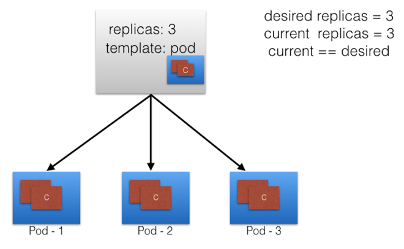
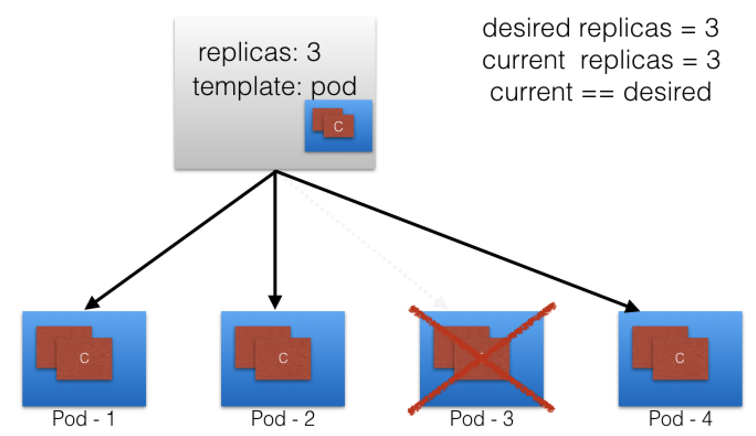
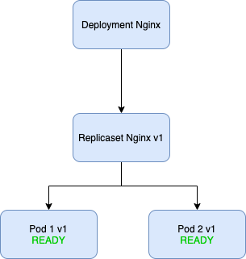
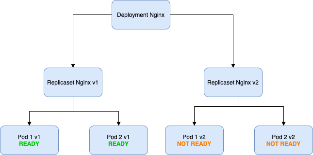
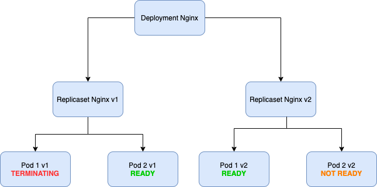
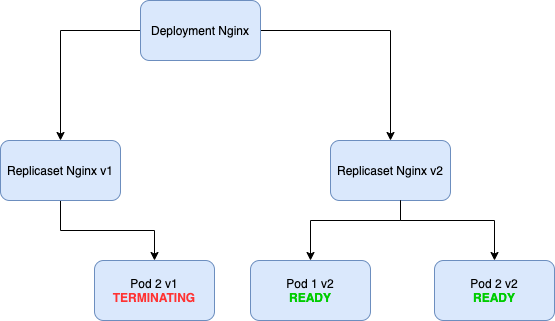
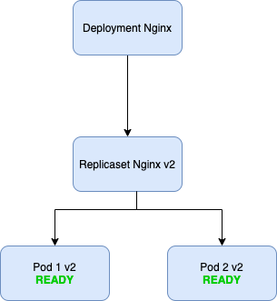

# Deployments

## Introduction - Workload resource controllers

[As we mentionned](../1-PODS/pods.md), Pods are
- *ephemeral* in nature
- and they *do not have the capability to self-heal* by themselves.

That is the reason **they are used with controllers** which handle Pods'
- replication
- fault tolerance
- self-healing
- seamless rollout/rollbacks


**Controllers for workload resources create Pods** from a **pod template** and manage those Pods on your behalf.

**PodTemplates are specifications for creating Pods**, and are included in **Kubernetes workload resources** such as Deployments, Jobs, and DaemonSets.

Each controller for a workload resource uses the PodTemplate inside the workload object to make actual Pods.
The **PodTemplate is part of the desired state of whatever workload resource you used to run your app**.

The sample below is a manifest for a simple Job with a template that starts one container.
The container in that Pod prints a message then pauses.

```
apiVersion: batch/v1
kind: Job
metadata:
  name: hello
spec:
  template:
    # This is the pod template
    spec:
      containers:
      - name: hello
        image: busybox
        command: ['sh', '-c', 'echo "Hello, Kubernetes!" && sleep 3600']
      restartPolicy: OnFailure
    # The pod template ends here
```

Modifying the pod template or switching to a new pod template has no effect on the Pods that already exist.
**Pods do not receive template updates directly; instead, a new Pod is created to match the revised pod template**.

For example, a ***Deployment controller*** ensures that the ***running Pods match*** the ***current pod template***.
If the template is updated, the controller has to remove the existing Pods and create new Pods based on the updated template.
Each workload controller implements its own rules for handling changes to the Pod template.

**Labels**
Workload resource controllers uses labels to match the pods that they will manage
key value pair that qualifies a pod and is used as a selector to define scope of
- Deployments
- Replicasets
- Services

## Replicasets
https://www.magalix.com/blog/kubernetes-replicaset-101

#### ***Description***

The Replicaset Workload Resource address some of the issues of dealing with "bare" pods (not encapsulated in controllers) in your cluster:
- **replication**: pods replicas are managed as a group and replicaset controller keep a predefined number of pods running

- **scalability**: easy to scale up/down nb of pods

	> kubectl scale --replicas=2 rs/web

	> kubectl autoscale rs web --max=5

- **self-healing**: restart pod if crashes

The ***replicaset controller*** makes sure that the ***desired state*** (number of replicas) ***matches the current state***.

Imagine the following situation:


Now, if pod n° 3 crashes => desired state != current state

Therefore the RS controller creates a new pod




#### ***Yaml Overview***

- In order for a ReplicaSet to work, it uses labels to know which pods it will manage so that it can restart the failing ones or kill the unneeded.

- To be able to create new pods if necessary, the ReplicaSet definition includes a template part containing the definition for new pods.

Let’s have an example.

```
apiVersion: apps/v1
kind: ReplicaSet
metadata:
  name: web
  labels:
	env: dev
	role: web
spec:
  replicas: 4
  selector:
	matchLabels:
  	  role: web
  template:
	metadata:
  	  labels:
    	    role: web
	spec:
  	  containers:
  	  - name: nginx
    	    image: nginx
```
Let’s examine the definition file that was used to create our ReplicaSet:

* The apiVersion for this object is currently app/v1
* The kind of this object is ReplicaSet
* In the metadata part, we define
  - the name by which we can refer to this ReplicaSet
  - a number of ***labels*** through which we can identify it.
* The spec part is mandatory in the ReplicaSet object. It defines:
  * The ***number of replicas this controller should maintain***. It default to 1 if it was not specified.
  * The selection criteria by which the ReplicaSet will choose its pods. **Be careful not to use a label that is already in use by another controller. Otherwise, another ReplicaSet may acquire the pod(s) first**
  * The pod template is used to create (or recreate) new pods. It has its own metadata, and spec where the containers are specified. **Also notice that the labels defined in the pod template (spec.template.metadata.label) cannot be different than those defined in the matchLabels part (spec.selector).**


#### ***Ownership***

It also needs to *check whether the target pod is already managed by another controller* (like a Deployment or another ReplicaSet).
So, for example if we need our ReplicaSet to manage all pods with the label role=webserver, the controller will search for any pod with that label.

It will also examine the **ownerReferences** field ***of the pod’s metadata to determine whether or not this pod is already owned by another controller***.
*If it isn’t,* the ***ReplicaSet will start controlling it***. Subsequently, the ownerReferences field of the target pods will be updated to reflect the new owner’s data.

> kubectl get pods online-contest-deployment-6569f4f9d6-4sz8w -o yaml

```
apiVersion: v1
kind: Pod
metadata:
  creationTimestamp: "2020-02-28T17:14:38Z"
  generateName: online-contest-deployment-6569f4f9d6-
  labels:
    app: online-contest
    pod-template-hash: 6569f4f9d6
  name: online-contest-deployment-6569f4f9d6-4sz8w
  namespace: default
  ownerReferences:
  - apiVersion: apps/v1
    blockOwnerDeletion: true
    controller: true
    kind: ReplicaSet
    name: online-contest-deployment-6569f4f9d6
    uid: d16250dc-201c-11ea-907f-7acf17853d52

```


#### ***Replicaset without downtime***

The RS behavior WRT taking ownership of pods that matches its label selector can produce this situation

- You fire up a pod

```
apiVersion: v1
kind: Pod
metadata:
  creationTimestamp: null
  labels:
    id: calc
  name: nginxalone
spec:
  containers:
  - image: nginx
    name: nginx
    resources: {}
  dnsPolicy: ClusterFirst
  restartPolicy: Never
status: {}
```
- You create a RS

```
apiVersion: apps/v1
kind: ReplicaSet
metadata:
  name: nginxbasicrs
  labels:
    app: nginxbasicrs
spec:
  # modify replicas according to your case
  replicas: 3
  selector:
    matchLabels:
      id: calc
  template:
    metadata:
      labels:
        id: calc
    spec:
      containers:
      - name: nginx
        image: nginx
```

Your replicaset will be made up of 3 replicas, but will ***actually create only 2 new pods***.

On the other way round, if you use the same label but your pod specs are different from RS pod template , if your pod crashes the RS is gonna spawn a pod that this in line with its pod template

**The bottom line: you should never create a pod with a label that matches the selector of a controller unless its template matches the pod definition**. The more-encouraged procedure is to always use a controller like a ReplicaSet or, even better, a Deployment to create and maintain your pods.

See challenge certif 13 replicaset without downtime!!!
https://codeburst.io/kubernetes-ckad-hands-on-challenge-13-replicaset-without-downtime-a9468d1fa994

#### ***RS Illustrations***

  <details>
    <summary> 1. RS without downtime</summary>

    **a. Initial pod**

    Create following pod:
    ```
    apiVersion: v1
    kind: Pod
    metadata:
      name: pod-calc
    spec:
      containers:
      - command:
        - sh
        - -c
        - echo "important calculation"; sleep 1d
        image: nginx
        name: pod-calc
    ```
    **b. Create RS including initial pod**

    The *previous pod is important, it cannot be shutdown* and re-created. But from today on, we *need to ensure two instances are always running*!
    *Create a ReplicaSet for the given pod* yaml above with 2 replicas always assured.
    *Make sure the ReplicaSet only creates one new pod and uses the existing and already running one as the second. NO DOWNTIME*

    **c. Solution**
    1) Create first pod
    2) Add a label to initial pod to make sure your RS will be able to include first in its scope based on label.

    ```
    kubectl label pod pod-calc rslab=nginxrs
    ```

    Check it:

    > kubectl get pods --show-labels

    ```
    NAME       READY   STATUS    RESTARTS   AGE   LABELS
    pod-calc   1/1     Running   0          75s   rslab=nginxrs
    ```


    3) Create RS using the previous label.

    ```
    apiVersion: apps/v1
    kind: ReplicaSet
    metadata:
      name: rsnginxdown
      labels:
        rs: rsnginxdown
    spec:
      # modify replicas according to your case
      replicas: 2
      selector:
        matchLabels:
          rslab: nginxrs
      template:
        metadata:
          labels:
            rslab: nginxrs
        spec:
          containers:
          - command:
            - sh
            - -c
            - echo "important calculation"; sleep 1d
            image: nginx
            name: pod-calc
    ```


    4) Check pods and rs status
    > kubectl get pods --show-labels
    ```
    NAME                READY   STATUS    RESTARTS   AGE   LABELS
    pod-calc            1/1     Running   0          10m   rslab=nginxrs
    rsnginxdown-k9v4j   1/1     Running   0          4s    rslab=nginxrs
    ```

    > kubectl get po,rs

    ```

    NAME                    READY   STATUS    RESTARTS   AGE
    pod/pod-calc            1/1     Running   0          11m
    pod/rsnginxdown-k9v4j   1/1     Running   0          47s

    NAME                          DESIRED   CURRENT   READY   AGE
    replicaset.apps/rsnginxdown   2         2         2       47s
    ```

  </details>
  <details>
    <summary> 2. Remove a pod from RS</summary>

    **a. Restart from previous RS**

    > kubectl get pods

    ```
    NAME                READY   STATUS    RESTARTS   AGE     LABELS
    pod-calc            1/1     Running   0          8h      rslab=nginxrs
    rsnginxdown-k9v4j   1/1     Running   0          7h52m   rslab=nginxrs
    ```

    **b. Remove one pod from RS**
    The idea here is to modify the labels of one pod so that it will not be part of the RS any more.

    > kubectl label pod rsnginxdown-k9v4j outrs=exitrs --overwrite

    > kubectl get pods --show-labels

    ```
    NAME                READY   STATUS    RESTARTS   AGE     LABELS
    pod-calc            1/1     Running   0          8h      rslab=nginxrs
    rsnginxdown-k9v4j   1/1     Running   0          7h54m   outrs=exitrs,rslab=nginxrs
    ```

    Remove the label used as selector for the RS:

    > kubectl label pod rsnginxdown-k9v4j rslab-

    ```
    NAME                READY   STATUS              RESTARTS   AGE     LABELS
    pod-calc            1/1     Running             0          8h      rslab=nginxrs
    rsnginxdown-k9v4j   1/1     Running             0          7h55m   outrs=exitrs
    rsnginxdown-rn5xd   0/1     ContainerCreating   0          2s      rslab=nginxrs
    ```


  </details>


## Deployments

#### ***Deployment description***

We've seen that ***RS workload resource*** offers interesting features compared to "bare" pods:
- ***self healing***
- ***scaling / autoscaling***
- ***replication***

RS achieves that through
- label selector to identify the pods in its scope
- replicas specification: defined number of pods to keep running
- pod template: specification needed to create/maintain pods

Although **RS controller** offers several interesting features, it has some **major drawbacks**: RS workload resource is **not able to handle modification of pod template** (for instance docker image version) **once they are up and running**.
As a result, you ***need to delete the current RS and recreate it. This leads to application downtime***.

A Deployment resource uses a ReplicaSet to manage the pods. However, it handles updating them in a controlled way.

The **key advantages** of using **Deployments** :
- it **encapsulates a Replicaset** so it offers
  - *self healing*
  - *scalability*
  - *replication*
- **Rolling updates without downtime**
- Power rollout features that make **rollbacks** easy


#### ***Yaml Overview***

```
apiVersion: apps/v1
kind: Deployment
metadata:
  name: apache-deployment
  labels:
    role: webserver
spec:
  replicas: 4
  selector:
    matchLabels:
      role: webserver
  template:
    metadata:
      labels:
        role: webserver
    spec:
      containers:
      - name: frontend
        image: httpd
        ports:
        - containerPort: 80
```

IMPORTANT TO KEEP TRACK OF REVISIONS

`kubectl apply -f apache_deployment.yaml --record`

Let’s have a look at the definition file that we used to bring those pods up:

* The file starts with the apiVersion that accepts the Deployment API object. Currently, it’s apps/v1.
* Then we have the type of resource: deployment.
* In the metadata, we define the name of this Deployment and its label.
* The ***spec*** field
  * ***replicas***: defines how many pods we need this Deployment to maintain.
  * contains the selection criteria that the controller uses to acquire the target pods. The ***matchLabels*** field targets pods labeled role=webserver.
  * ***pod template*** that is used to ***create (or recreate) the pods***.
    * The spec.template.metadata defines the label that new pods will have.
    * The spec.template.spec part has the actual container definition (owned by the container field)

#### ***Remark on pod labels***

Let's try to run the following deployment:


```
apiVersion: apps/v1
kind: Deployment
metadata:
  creationTimestamp: null
  labels:
    app: webapp
  name: webapp
spec:
  replicas: 2
  selector:
    matchLabels:
      app: webapp
  strategy: {}
  template:
    metadata:
      creationTimestamp: null
      labels:
        app: webapp
    spec:
      containers:
      - image: nginx
        name: nginxdep
        resources: {}
status: {}
```

if you describe the pod you'll see

```
apiVersion: v1
kind: Pod
metadata:
  creationTimestamp: "2020-06-07T01:36:55Z"
  generateName: webapp-f5f58ffd4-
  labels:
    app: webapp
    pod-template-hash: f5f58ffd4
  name: webapp-f5f58ffd4-pdzfh
  namespace: default
  ownerReferences:
  - apiVersion: apps/v1
    blockOwnerDeletion: true
    controller: true
    kind: ReplicaSet
    name: webapp-f5f58ffd4
    uid: 29da8e05-d783-4f31-91e1-9b1e3140ce29
  resourceVersion: "2421318"
  selfLink: /api/v1/namespaces/default/pods/webapp-f5f58ffd4-pdzfh
  uid: 7f86605b-ed1a-470d-a836-980423d8cf48
spec:
  containers:
  ...
```

- ownership of the pod is the replicaset encapsulated in the deployment
- two labels have been added
  - one specified in the deployment template : ***app=webapp***
  - one generated by the RS : ***pod-template-hash: f5f58ffd4***


#### ***Rolling Updates***

A key feature of kubernetes deployments is the management of
- updates
- upgrades
- rollbacks

In such a way that there will not be any downtime for your micro service.
Let's take an example : imagine a deployment nginx, with 2 replicas based on image ngnix 1.0.0


Now let's say we want to upgrade to ngnix 2.0.0
Basically the deployment controller will trigger the creation of a new replicaset.


Pods from initial resplicaset won't be terminated before pods from the new replicaset are up and running.


They won't terminate old pods before new pods from the new RS are rolled out.


As a result, there won't be any downtime. As we can see in the last image, RS 1 is removed only when curret state == desired state with 2nd RS.



***Rollout***

Imagine a deployment called "webapp", based on a nginx docker image.

```
apiVersion: apps/v1
kind: Deployment
metadata:
  creationTimestamp: null
  labels:
    app: webapp
  name: webapp
spec:
  replicas: 1
  selector:
    matchLabels:
      app: webapp
  strategy: {}
  template:
    metadata:
      creationTimestamp: null
      labels:
        app: webapp
    spec:
      containers:
      - image: nginx:1.17.1
        name: nginx
        resources: {}
        ports:
        - containerPort: 80
status: {}

```

The initial deployment is based on image nginx:1.17.1.

At that stage, the rollout history is:

```
kubectl describe deployments.apps webapp
Name:                   webapp
Namespace:              default
CreationTimestamp:      Sun, 07 Jun 2020 04:05:33 +0200
Labels:                 app=webapp
Annotations:            deployment.kubernetes.io/revision: 1
                        kubectl.kubernetes.io/last-applied-configuration:
                          {"apiVersion":"apps/v1","kind":"Deployment","metadata":{"annotations":{},"creationTimestamp":null,"labels":{"app":"webapp"},"name":"webapp...
Selector:               app=webapp
Replicas:               1 desired | 1 updated | 1 total | 1 available | 0 unavailable
StrategyType:           RollingUpdate
MinReadySeconds:        0
RollingUpdateStrategy:  25% max unavailable, 25% max surge
Pod Template:
  Labels:  app=webapp
  Containers:
   nginx:
    Image:        nginx:1.17.1
    Port:         80/TCP
    Host Port:    0/TCP
    Environment:  <none>
    Mounts:       <none>
  Volumes:        <none>
Conditions:
  Type           Status  Reason
  ----           ------  ------
  Available      True    MinimumReplicasAvailable
  Progressing    True    NewReplicaSetAvailable
OldReplicaSets:  <none>
NewReplicaSet:   webapp-84c76cb8cc (1/1 replicas created)
Events:
  Type    Reason             Age    From                   Message
  ----    ------             ----   ----                   -------
  Normal  ScalingReplicaSet  2m17s  deployment-controller  Scaled up replica set webapp-84c76cb8cc to 1
```

We see that image "nginx:1.17.1", and rollout history indicates one single revision.

`kubectl rollout history deployment webapp`

```
deployment.apps/webapp
REVISION  CHANGE-CAUSE
1         <none>
```

Basically, if we describe the deployment we see something intestesting:

```
kubectl get deployments.apps webapp -o yaml
apiVersion: apps/v1
kind: Deployment
metadata:
  annotations:
    deployment.kubernetes.io/revision: "1"
    kubectl.kubernetes.io/last-applied-configuration: |
      {"apiVersion":"apps/v1","kind":"Deployment","metadata":{"annotations":{},"creationTimestamp":null,"labels":{"app":"webapp"},"name":"webapp","namespace":"default"},"spec":{"replicas":1,"selector":{"matchLabels":{"app":"webapp"}},"strategy":{},"template":{"metadata":{"creationTimestamp":null,"labels":{"app":"webapp"}},"spec":{"containers":[{"image":"nginx:1.17.1","name":"nginx","ports":[{"containerPort":80}],"resources":{}}]}}},"status":{}}
  creationTimestamp: "2020-06-07T02:05:33Z"
  generation: 1
  labels:
    app: webapp
  name: webapp
  namespace: default
  resourceVersion: "2425485"
  selfLink: /apis/apps/v1/namespaces/default/deployments/webapp
  uid: 1a60b207-c600-4b41-be48-2ccffe53d798
spec:
  progressDeadlineSeconds: 600
  replicas: 1
  revisionHistoryLimit: 10
```

Basically we see a field "revisionHistoryLimit" which indicates the max number of versions (updates, undo...) related to a deployment.
We see that it keeps tracks of the revision (the changes you've made to your deployment).

If we go further into that, we see that there is a limit to the version that your deployment is going to keep as revision in its history.

You can describe rollout history for a specific version (REVISION).
In our situation, there is only on revision :

`kubectl rollout history deployment webapp --revision=1`

results in:

```
deployment.apps/webapp with revision #1
Pod Template:
  Labels:	app=webapp
	pod-template-hash=84c76cb8cc
  Containers:
   nginx:
    Image:	nginx:1.17.1
    Port:	80/TCP
    Host Port:	0/TCP
    Environment:	<none>
    Mounts:	<none>
  Volumes:	<none>
```


We see that it keeps tracks of the revision (the changes you've made to your deployment).

If we go further into that, we see that there is a limit to the version that your deployment is going to keep as revision in its history.
This is actually the main added value of a deployment : you can easily rollout/rollbacks.
In addition to that, when it processes a rollout/rollback, a new replicaset will be created and it will progressively creates new pods before the previous replicaset terminates its pods.
Therefore, there won't be any downtime.


***Rollout update/updrade***


`kubectl rollout history deployment ciro -o yaml`


```
apiVersion: apps/v1
kind: Deployment
metadata:
  annotations:
    deployment.kubernetes.io/revision: "1"
  creationTimestamp: "2020-04-30T02:30:56Z"
  generation: 1
  labels:
    app: ciro
  name: ciro
  namespace: default
  resourceVersion: "213539"
  selfLink: /apis/apps/v1/namespaces/default/deployments/ciro
  uid: ad934a2b-6d3b-4d94-80cc-5cbcf36555ef
spec:
  progressDeadlineSeconds: 600
  replicas: 2
  revisionHistoryLimit: 10
  selector:
    matchLabels:
      app: ciro
  strategy:
    rollingUpdate:
      maxSurge: 25%
      maxUnavailable: 25%
    type: RollingUpdate
  template:
    metadata:
      creationTimestamp: null
      labels:
        app: ciro
    spec:
      containers:
      - image: pgolard/test-ciro:v3
        imagePullPolicy: IfNotPresent
        name: ciro
        ports:
        - containerPort: 7777
          protocol: TCP
        resources: {}
        terminationMessagePath: /dev/termination-log
        terminationMessagePolicy: File
      dnsPolicy: ClusterFirst
      restartPolicy: Always
      schedulerName: default-scheduler
      securityContext: {}
      terminationGracePeriodSeconds: 30
status:
  availableReplicas: 2
  conditions:
  - lastTransitionTime: "2020-04-30T02:30:59Z"
    lastUpdateTime: "2020-04-30T02:30:59Z"
    message: Deployment has minimum availability.
    reason: MinimumReplicasAvailable
    status: "True"
    type: Available
  - lastTransitionTime: "2020-04-30T02:30:56Z"
    lastUpdateTime: "2020-04-30T02:30:59Z"
    message: ReplicaSet "ciro-59ffbfbf4f" has successfully progressed.
    reason: NewReplicaSetAvailable
    status: "True"
    type: Progressing
  observedGeneration: 1
  readyReplicas: 2
  replicas: 2
  updatedReplicas: 2
```

#### Upgrade the deployment

`kubectl set image deployment ciro ciro=pgolard/test-ciro:v4 --record`


`kubectl rollout status deployment ciro`

```
deployment "ciro" successfully rolled out
```

`kubectl rollout history deployment ciro`

```
deployment.apps/ciro
REVISION  CHANGE-CAUSE
1         <none>
2         kubectl set image deployment ciro ciro=pgolard/test-ciro:v4 --record=true
```

#### check pods and replicasets

`kubectl get pods --show-labels -o wide`


```
NAME                         READY   STATUS    RESTARTS   AGE    IP            NODE       NOMINATED NODE   READINESS GATES   LABELS
ciro-6ffb8758f6-qblzg        1/1     Running   0          104s   172.17.0.9    minikube   <none>           <none>            app=ciro,pod-template-hash=6ffb8758f6
ciro-6ffb8758f6-vgqzr        1/1     Running   0          100s   172.17.0.10   minikube   <none>           <none>            app=ciro,pod-template-hash=6ffb8758f6
savastano-79b985b446-4zzxj   1/1     Running   0          32m    172.17.0.3    minikube   <none>           <none>            app=savastano,pod-template-hash=79b985b446
savastano-79b985b446-rp8xd   1/1     Running   0          32m    172.17.0.2    minikube   <none>           <none>            app=savastano,pod-template-hash=79b985b446
```

`kubectl get deploy,rs`

```
NAME                        READY   UP-TO-DATE   AVAILABLE   AGE
deployment.apps/ciro        2/2     2            2           33m
deployment.apps/savastano   2/2     2            2           34m

NAME                                   DESIRED   CURRENT   READY   AGE
replicaset.apps/ciro-59ffbfbf4f        0         0         0       33m
replicaset.apps/ciro-6ffb8758f6        2         2         2       3m46s
replicaset.apps/savastano-79b985b446   2         2         2       34m
```

Please PAY ATTENTION TO replicasets:
we now see that ciro deployment has had 2 different replicasets
- the initial one with desired and current nb of replicas set to zero
- the new one with desired and current nb of replicas set to 2

This also illustrates the role of the replicaset controller that makes sure current and desired state are equal.

### rollback
Let's say that we now want to rollback our last upgrade and move back to the first revision:

`kubectl rollout undo deployment ciro --to-revision=1`

`kubectl rollout history deployment ciro`

```
deployment.apps/ciro
REVISION  CHANGE-CAUSE
2         kubectl set image deployment ciro ciro=pgolard/test-ciro:v4 --record=true
3         <none>
```

We see that we got back the v3 image.

`kubectl rollout history deployment ciro --revision=3`


```
deployment.apps/ciro with revision #3
Pod Template:
  Labels:	app=ciro
	pod-template-hash=59ffbfbf4f
  Containers:
   ciro:
    Image:	pgolard/test-ciro:v3
    Port:	7777/TCP
    Host Port:	0/TCP
    Environment:	<none>
    Mounts:	<none>
  Volumes:	<none>
```

## Methods to create a deployment

### Pure Yaml

```
apiVersion: apps/v1
kind: Deployment
metadata:
  creationTimestamp: null
  labels:
    app: savastano
  name: savastano
spec:
  replicas: 2
  selector:
    matchLabels:
      app: savastano
  strategy: {}
  template:
    metadata:
      creationTimestamp: null
      labels:
        app: savastano
    spec:
      containers:
      - image: pgolard/test-savastano:v3
        name: savastano
        ports:
        - containerPort: 9999
        resources: {}
```

-	The apiVersion field is the first required field, and it specifies the API endpoint on the API server which we want to connect to; it must match an existing version for the object type defined.
-	The second required field is kind, specifying the object type - in our case it is Deployment, but it can be Pod, Replicaset, Namespace, Service, etc.
-	The third required field metadata, holds the object's basic information, such as name, labels, namespace, etc. Our example shows two spec fields (spec and spec.template.spec).
-	The fourth required field spec marks the beginning of the block defining the desired state of the Deployment object.

### Pure Command line
ATTENTION this method is deprecated
> kubectl run --dry-run=client -o yaml savastano --image=pgolard/test-savastano:v3 --labels=app=savastano --replicas=2 --port=9999


```
apiVersion: apps/v1
kind: Deployment
metadata:
  creationTimestamp: null
  labels:
    app: savastano
  name: savastano
spec:
  replicas: 2
  selector:
    matchLabels:
      app: savastano
  strategy: {}
  template:
    metadata:
      creationTimestamp: null
      labels:
        app: savastano
    spec:
      containers:
      - image: pgolard/test-savastano:v3
        name: savastano
        ports:
        - containerPort: 9999
        resources: {}
```

### Mix Command line & Yaml

> kubectl create deployment --dry-run=client -o yaml savastano --image=pgolard/test-savastano:v3

```
apiVersion: apps/v1
kind: Deployment
metadata:
  creationTimestamp: null
  labels:
    app: savastano
  name: savastano
spec:
  replicas: 1
  selector:
    matchLabels:
      app: savastano
  strategy: {}
  template:
    metadata:
      creationTimestamp: null
      labels:
        app: savastano
    spec:
      containers:
      - image: pgolard/test-savastano:v3
        name: test-savastano
        resources: {}
```

Then update some fields like number of replicas...

`kubectl get pods -l env=prod --show-labels`


## Deployment Event Chain

You find below a summary of what happens when you ask the API server to create a deployment using your ***kubectl*** command:


