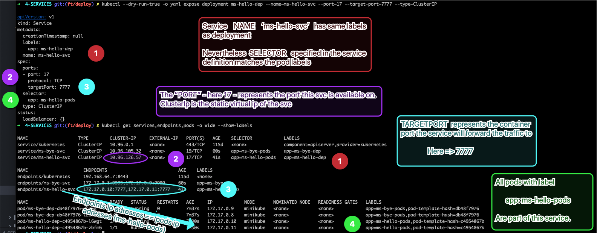
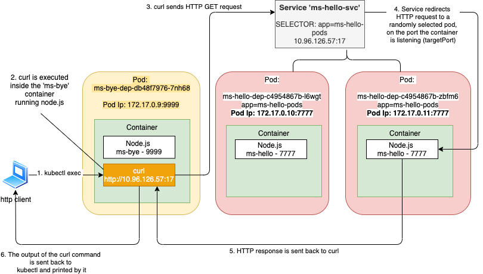
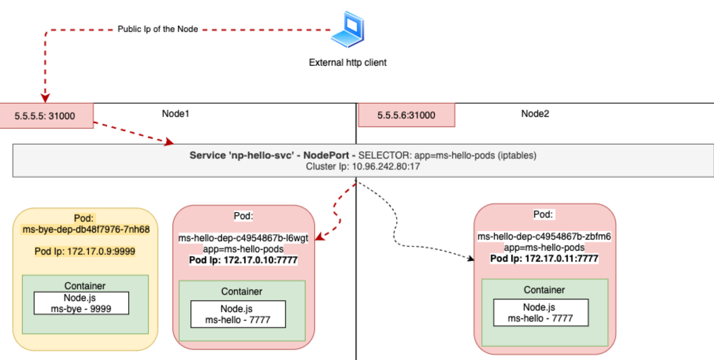

# Services

In this section we're going to talk about **services**.
Services are an essential component of Kubernetes, basically used to ***expose pods*** (directly or through deployments/replicasets) by providing a ***Static Virtual IP***.

- [Services](#services)
  - [Dummy Applications](#dummy-applications)
      - [Docker Images](#docker-images)
      - [Kubernetes Deployments Definitions](#kubernetes-deployments-definitions)
      - [Kubernetes Deployments Analysis](#kubernetes-deployments-analysis)
  - [Services overview](#services-overview)
      - [Vocation](#vocation)
      - [Service specifications](#service-specifications)
      - [Illustration](#illustration)
  - [Core Networking](#core-networking)
      - [Kube-proxy](#kube-proxy)
      - [Kube-dns](#kube-dns)
      - [Controllers](#controllers)
  - [Service Discovery](#service-discovery)
      - [DNS](#dns)
      - [Environment Variables](#environment-variables)
  - [Types of services](#types-of-services)
      - [Services without Pod SELECTOR](#services-without-pod-selector)
        - [***Manually configuring EndPoints***](#manually-configuring-endpoints)
        - [***ExternalName Service***](#externalname-service)
      - [headless service](#headless-service)
      - [ClusterIP](#clusterip)
      - [NodePorts](#nodeports)
        - [LoadBalancer](#loadbalancer)
      - [Multiple Ports service](#multiple-ports-service)


TODO mention sessionAffinity if you want to always direct traffic to same pods - p 126 book

## Dummy Applications

#### Docker Images

To illustrate the concepts of this chapter, we use 2 basic **[node.js applications](../docker-images/node-app/svc-section/)**, built as docker images and pushed on a public docker hub repository.


Those 2 node.js applications *ms-hello* and *ms-bye*
- communicate together via REST calls through route `/sayHelloToBye`   defined in ms-bye
- their container images are built from a `custom node.js docker image`  that include *telnet, netcat, ping, curl, dnslookup*

will be used to illustrate the key concepts of kubernetes ***services*** objects.

Those 2 applications listen on port 9999 for ms-hello and port 7777 for ms-bye.

#### Kubernetes Deployments Definitions

We now package the applications in Deployments. Small refresher on deployments :

<u>Deployment</u> is a workload kubernetes controller
- offers advanced features for zero downtime rollout & rollbacks
- manage pods through a <u>ReplicaSet</u> Controller that offers
  * self-healing & replication: watches that  ***current*** number of pods running is always in line with the ***desired***
  * scalability

Below we see the deployment manifest for ms-hello and ms-bye deployments.
- *spec/template* :arrow_right: pod specifications - manifest that describes how to create/maintain pods
  * *spec/template/metadata/labels* :arrow_right:  labels that will be assigned to pods
  * *spec/template/spec/containers* :arrow_right: properties of our container (here single container pods) - most important *image* and *containerPort*
- *metadata/labels* :arrow_right: deployments label specifications - here label is different between pods & deployment
- *spec* :arrow_right: ReplicaSet Specifications - manifest that describes how to manage pods
  * *spec/replicas* :arrow_right:  desired number of pods running simultaneously
  * *spec/selector/matchLabels* :arrow_right: the ownership / set of pods managed by the RS (and therefore the deployment). Here, on purpose, deployment label and pod labels are different


<table>
<tr>
<th>ms-bye</th>
<th>ms-hello</th>
</tr>
<tr>
<td>
<pre>
apiVersion: apps/v1
kind: Deployment
metadata:
  labels:
    app: ms-bye-dep
  name: ms-bye-dep
spec:
  replicas: 2
  selector:
    matchLabels:
      app: ms-bye-pods
  template:
    metadata:
      labels:
        app: ms-bye-pods
    spec:
      containers:
      - image: pgolard/ms-bye:v4
        name: ms-bye
        ports:
        - containerPort: 9999
</pre>
</td>
<td>
<pre>
apiVersion: apps/v1
kind: Deployment
metadata:
  labels:
    app: ms-hello-dep
  name: ms-hello-dep
spec:
  replicas: 2
  selector:
    matchLabels:
      app: ms-hello-pods
  template:
    metadata:
      labels:
        app: ms-hello-pods
    spec:
      containers:
      - image: pgolard/ms-hello:v4
        name: ms-hello
        ports:
        - containerPort: 7777
</pre>
</td>
</tr>
</table>

Now we create our deployments :

```yaml
kubectl apply -f illustrations/initial_objects/ms-bye-dep.yaml
kubectl apply -f illustrations/initial_objects/ms-hello-dep.yaml
```

#### Kubernetes Deployments Analysis

We observe the following properties:

```yaml
 kubectl get deploy,rs,po -o wide --show-labels
```

The previous command displays details of deployments, replicasets and pods :

```yaml
NAME                           READY   UP-TO-DATE   AVAILABLE   AGE     CONTAINERS   IMAGES                SELECTOR            LABELS
deployment.apps/ms-bye-dep     2/2     2            2           3m48s   ms-bye       pgolard/ms-bye:v4     app=ms-bye-pods     app=ms-bye-dep
deployment.apps/ms-hello-dep   2/2     2            2           3m41s   ms-hello     pgolard/ms-hello:v4   app=ms-hello-pods   app=ms-hello-dep
NAME                                     DESIRED   CURRENT   READY   AGE     CONTAINERS   IMAGES                SELECTOR                                        LABELS
replicaset.apps/ms-bye-dep-db48f7976     2         2         2       3m48s   ms-bye       pgolard/ms-bye:v4     app=ms-bye-pods,pod-template-hash=db48f7976     app=ms-bye-pods,pod-template-hash=db48f7976
replicaset.apps/ms-hello-dep-c4954867b   2         2         2       3m41s   ms-hello     pgolard/ms-hello:v4   app=ms-hello-pods,pod-template-hash=c4954867b   app=ms-hello-pods,pod-template-hash=c4954867b
NAME                               READY   STATUS    RESTARTS   AGE     IP            NODE       NOMINATED NODE   READINESS GATES   LABELS
pod/ms-bye-dep-db48f7976-7nh68     1/1     Running   0          3m48s   172.17.0.9    minikube   <none>           <none>            app=ms-bye-pods,pod-template-hash=db48f7976
pod/ms-bye-dep-db48f7976-l22l2     1/1     Running   0          3m48s   172.17.0.8    minikube   <none>           <none>            app=ms-bye-pods,pod-template-hash=db48f7976
pod/ms-hello-dep-c4954867b-l6wgt   1/1     Running   0          3m41s   172.17.0.10   minikube   <none>           <none>            app=ms-hello-pods,pod-template-hash=c4954867b
pod/ms-hello-dep-c4954867b-zbfm6   1/1     Running   0          3m41s   172.17.0.11   minikube   <none>           <none>            app=ms-hello-pods,pod-template-hash=c4954867b
```

- We remark that at ***deployment*** level, even though the specified label was different between deployments and rs/pods, the relationship is clearly stated under SELECTOR section.
- At the ***replica set*** level, we see that another label has been generated, even though it was not mentioned in our yaml files: the <u>*pod-template-hash*</u>, as the "key". We can even see the "value" of this pod-template-hash
  * is the suffix of the RS name
  * the "key"-"value" pair of the <u>*pod-template-hash*</u>, in addition to the label specified in our yaml definition (app=ms-bye-pods or app=ms-hello-pods), constitute the SELECTOR section of the replicasets.
- At the ***pod*** level, we also see that the <u>*pod-template-hash*</u> "key"-"value" pair has been added to LABELS section.

This <u>*pod-template-hash*</u> is interesting: it highlights the relationship between ***ReplicaSet Lifecycle*** and ***pod template modifications*** within our deployments (detailed in deployment section). Basically, the lifecycle within a deployment is:

> Deployment Lifecycle > ReplicaSet Lifecycle > Pod Lifecycle

as well as equals to this

> Deployment Lifecycle > ReplicaSet Lifecycle = Pod Template Specification

As we explained, the RS is responsible for creating and maintaining pods <u>according to the pod template manifest section</u> within the deployment yaml definition. If the pod specification is modified, for instance when you change the container image version, the deployment controller creates a new Replicaset to ensure zero downtime (see deployment rolling updates, rollout).

When we take a look at the previous detailed snapshot, we also remark that **ips** are defined at the **pod level** only ("one ip Per Pod" model).

It's time now to have a look at the utils added to our node js image. We pickup a pod ip of ms-bye (for instance 172.17.0.8) and we run in attached mode some commands from one of the ms-hello pod, to see if both pods can communicate using ip and ports within our kubernetes cluster :


> kubectl exec -it ms-hello-dep-69558b588b-9jcm7 telnet 172.17.0.8 9999
```
Trying 172.17.0.8...
Connected to 172.17.0.8.
Escape character is '^]'.
^CConnection closed by foreign host.
command terminated with exit code 1
```

ff

> kubectl exec -it ms-hello-dep-69558b588b-9jcm7 ping 172.17.0.8
```
PING 172.17.0.8 (172.17.0.8) 56(84) bytes of data.
64 bytes from 172.17.0.8: icmp_seq=1 ttl=64 time=0.066 ms
64 bytes from 172.17.0.8: icmp_seq=2 ttl=64 time=0.060 ms
64 bytes from 172.17.0.8: icmp_seq=3 ttl=64 time=0.121 ms
64 bytes from 172.17.0.8: icmp_seq=4 ttl=64 time=0.067 ms
64 bytes from 172.17.0.8: icmp_seq=5 ttl=64 time=0.059 ms
64 bytes from 172.17.0.8: icmp_seq=6 ttl=64 time=0.057 ms
64 bytes from 172.17.0.8: icmp_seq=7 ttl=64 time=0.061 ms
64 bytes from 172.17.0.8: icmp_seq=8 ttl=64 time=0.063 ms
64 bytes from 172.17.0.8: icmp_seq=9 ttl=64 time=0.054 ms
64 bytes from 172.17.0.8: icmp_seq=10 ttl=64 time=0.043 ms
64 bytes from 172.17.0.8: icmp_seq=11 ttl=64 time=0.042 ms
^C
--- 172.17.0.8 ping statistics ---
11 packets transmitted, 11 received, 0% packet loss, time 10225ms
rtt min/avg/max/mdev = 0.042/0.063/0.121/0.019 ms

```

l

> kubectl exec -it ms-hello-dep-69558b588b-9jcm7 curl 172.17.0.8:9999
```
This is the test bye with custom node parent image
```


## Services overview

#### Vocation


Even though we saw in the networking section that "Ip Per Pod"  model ensures that any pod can communicate with an other, Kubernetes Pods are mortal, transient:

- They are born and when they die, they are not resurrected (pod removed from a node to make room for others + reschedule on another node, cluster node fails...)
- They can be scaled up/down, they can replaced (rolling update, rollbacks, upgrades)...


Remember some of the initial promises of k8s as an advanced containerized micro services orchestrator:
- scalability & high availability
- reduced complexity (notably networking)
- load balancing and service discovery


Therefore, it is impossible to keep track of pods' ip if you want your MS to communicate together inside your cluster.
The sustainable solution, to make sure that your microservices can communicate, is called the service, another k8s resource.

A Service is an abstraction which defines
- a ***logical set of Pods*** determined by a **selector** (except 1 type of svc - externalName)
- a ***policy*** by which to access them (port, protocol, targetPort)

Basically, a service consists of a ***static virtual ip*** (cluster ip), while this logical ***set of pods*** make up the ***real Endpoints*** of this virtual ip. When request is sent to this virtual ip, traffic (through kube-proxy) is randomly forwarded (***load balanced***) to one of the pods backing the service.

The IP address is virtual—it’s not assigned to any network interfaces and is never listed as either the source or the destination IP address in a network packet.
A key detail of Services is that they consist of an IP and port pair (or multiple IP and port pairs in the case of multi-port Services), so the service IP by itself doesn’t represent anything. *That’s why you can’t ping them.*

#### Service specifications

Basically you can expose pods (potentially pods managed through deployments) using the command line via the following command:


```yaml
kubectl --dry-run=true -o yaml expose deployment ms-bye-dep --name=ms-bye-svc --port=19 --target-port=9999 --type=ClusterIP
kubectl --dry-run=true -o yaml expose deployment ms-hello-dep --name=ms-hello-svc --port=17 --target-port=7777 --type=ClusterIP
```
The dry-run option means that we do not want, at this stage to actually generate the service, we want to show what the yaml of the service definition would look like.

This would result into that for each service
```yaml
apiVersion: v1
kind: Service
metadata:
  labels:
    app: ms-bye-dep
  name: ms-bye-svc
spec:
  ports:
  - port: 19
    protocol: TCP
    targetPort: 9999
  selector:
    app: ms-bye-pods
  type: ClusterIP
---
apiVersion: v1
kind: Service
metadata:
  labels:
    app: ms-hello-dep
  name: ms-hello-svc
spec:
  ports:
  - port: 17
    protocol: TCP
    targetPort: 7777
  selector:
    app: ms-hello-pods
  type: ClusterIP
```

We currently set aside the service type. We'll see that deeper in the next section.

<u>***metadata***</u>
  * `name` : service name - important property since it will be used in kube-dns
  * `labels` : <key,value> pair that describes the svc and potentially show the relationship with  k8s objects the current service is exposing (for instance the deployment label)


<u>***spec***</u>
  * `selector` : <key,value> - defines a logical set of Pods that are backing the service and constitute the real ENDPOINTS of the service. Basically the iptables can keep track of those pods using the selector criteria to filter out the pods the traffic needs to be forwarded to. 
  * `type` : there are several types of services that can be created. They will be described later on in that chapter. Here we see the most basic type <ClusterIp>. This consists of a static virtual ip that exposes a logical set of pods WITHIN the cluster. The cluster ip in itself is not accessible from outside the cluster.

  <u>***ports***</u>
  This section accepts potentially an array of ports. We will see in next section an example of *Service with multiple Ports*. As we now want to do a simple overview let's work with a service that is forwarding traffic to pods on one single port.
    * `port` : port of the service. This is the port the service is available on. Port and Target Port can be different (we will see further when it can be useful)
    * `name` : name of the port - useful when one service has to redirect traffic to multiple ports.
    * `targetPort` : port of the pod (actually port of the container inside the pod). This is the port the traffic will be forwarded to.
    * `protocol` : TCP, UDP or HTTP

Regarding the lifecycle of a service: the static virtual ip address is tied to the lifespan of the Service :arrow_right: address will not change until you keep the service alive.
In the meantime, if you
- remove/add pods
- scale up/down
- change pod template definition (upgrade docker image...)

This will generate modifications in the logical set of pods that are bound to the service (new EndPoints ip adresses) but the kube-proxy will keep track of those modifications in the ip-tables. Thanks to this mechanism, when you pods are exposed through services, you do not need to worry about Endpoints ip modifications.

#### Illustration

We saw in the previous that our pods can be exposed through services. We also went through the yaml definition of a service.
Let's create those services.

```yaml
kubectl apply -f illustrations/initial_objects/ms-bye-svc.yaml
kubectl apply -f illustrations/initial_objects/ms-hello-svc.yaml
```

Then we'll focus on the ms-hello pods and services.
If you run the following command, you will see information about pods, services and end points:
```yaml
kubectl get pods,services,endpoints -o wide --show-labels
```


The picture below highlights the elements we described in the previous section:



In order to manipulate and illustrate the services, we will use the utils of our node.js custom docker image.


First let's run a `curl` . To do so, we're going to use `kubectl exec`   command that allows you to remotely run arbitrary commands inside an existing container of a pod.
In our example, we're going to
- connect to a pod that is part of our *ms-bye-dep*
- run a curl command that will generate an HTTP request to our service *ms-hello-svc*:*svc port*. This service is backed by 2 pods from our ms-hello deployment.




```yaml
 kubectl exec ms-bye-dep-db48f7976-7nh68 -- curl -X GET http://10.96.126.57:17
```

We see in the terminal that we get an answer (hello world message at the root of our ms-hello microservice. Please see the docker image section to go through the code):
```yaml
% Total    % Received % Xferd  Average Speed   Time    Time     Time  Current
                               Dload  Upload   Total   Spent    Left  Speed
100    42  100    42    0     0  13990      0 --:--:-- --:--:-- --:--:-- 21000
This is the hello world custom node parent%
```

We have to connect to a pod to run the "curl" command since the service type of "ms-hello-svc" is **ClusterIp**, which means the static virtual ip is only *accessible INSIDE our kubernetes cluster*.
Please note that we could have used any of our 4 pods to run the curl command, as long as we run the command from within the cluster.
If your cluster is running on minikube, you can also ssh into your minikube VM and run the curl comand, using the clusterIp since your cluster is running on minikube VM:


In the picture below we see on the left a terminal where we have run our "curl" command several times.
On the right pane, we see the results of a "watch" command on the two pods that are backing the ms-hello-svc (the actual 2 end points of our ms-hello-svc service), which means that `kubectl logs <podName>`  is refreshed every 2 seconds.


> watch kubectl logs ms-hello-dep-c4954867b-l6wgt

> watch kubectl logs ms-hello-dep-c4954867b-zbfm6


We notice that even though we make an HTTP request to the  *ms-hello-svc*:*svc port*
- traffic is finally forwarded to the actual **ENDPOINTS**, namely the 2 pods of deployment *ms-hello-dep*, on the port the containers are listening on (**TARGETPORT**)
- client ip adress (*172.17.0.9*) is *ms-bye-dep* pod ip adress, except the last curl request (see bottow right) we ran from minikube's vm
- after we repeat the operation, traffic is **load-balanced** between pods

Let's run some other tests:
- <u>netcat</u>: check if connection is open on service ip (or dns) and port


> kubectl exec ms-bye-dep-db48f7976-7nh68 -- nc -zv ms-hello-svc 17
```yaml
ms-hello-svc.default.svc.cluster.local [10.96.126.57] 17 (qotd) open
```

- <u>nslookup</u>: resolve dns entries

```yaml
kubectl exec ms-bye-dep-db48f7976-7nh68 -- busybox nslookup ms-hello-svc


Server:    10.96.0.10
Address 1: 10.96.0.10 kube-dns.kube-system.svc.cluster.local

Name:      ms-hello-svc
Address 1: 10.96.126.57 ms-hello-svc.default.svc.cluster.local
```

- <u>ping</u>: while *telnet* and *netcat* ran successfully on the service ip adress and service port, ping is not working using the service static ip adress. On the other hand, we see that we can ping the pod ip adress :

```yaml
kubectl exec ms-bye-dep-db48f7976-7nh68 -- ping 10.96.126.57
^C
```

```yaml
kubectl exec ms-bye-dep-db48f7976-7nh68 -- ping 172.17.0.10
PING 172.17.0.10 (172.17.0.10) 56(84) bytes of data.
64 bytes from 172.17.0.10: icmp_seq=1 ttl=64 time=0.096 ms
64 bytes from 172.17.0.10: icmp_seq=2 ttl=64 time=0.171 ms
64 bytes from 172.17.0.10: icmp_seq=3 ttl=64 time=0.076 ms
64 bytes from 172.17.0.10: icmp_seq=4 ttl=64 time=0.157 ms
64 bytes from 172.17.0.10: icmp_seq=5 ttl=64 time=0.079 ms
64 bytes from 172.17.0.10: icmp_seq=6 ttl=64 time=0.109 ms
64 bytes from 172.17.0.10: icmp_seq=7 ttl=64 time=0.162 ms
64 bytes from 172.17.0.10: icmp_seq=8 ttl=64 time=0.096 ms
```
That’s because the service’s cluster IP is a virtual IP, and only has meaning when combined with the service port.


## Core Networking

Before going further in the service resource definition, we need to go back to subjects we discussed in the chapter dedicated to kubernetes architecture:
- kube-proxy
- kube-dns

Now that we are more familiar with kubernetes objects, diving into kubernetes core networking is more interesting.

#### Kube-proxy


Everything related to Services is handled by the kube-proxy pod **running on each node**.

Initially, the kube-proxy was an actual proxy waiting for connections and for each incoming connection, opening a new connection to one of the pods. This was called the userspace proxy mode.


Later, a better-performing *iptables proxy mode* replaced it. Kube-proxy looks now like a railway switchman.

Actually kube-proxy is part of a **DaemonSet**: a set of pods that makes sure one pod the daemonset is running on EVERY node of your cluster (**1 pod per node**).


When a service is created in the API server, the virtual IP address is assigned to it immediately.
Soon afterward, the API server **notifies all kube-proxy agents running on the worker nodes** that a **new Service has been created.**

Each kube-proxy **makes that service addressable** on its node by setting up **iptables rules,** which make sure

- each ***packet*** destined for the **service IP/port** pair is **intercepted**
- its **destination address modified**, so the packet is redirected to one of the **pods backing** the **service** (redirected to an EndPoint)

Besides **watching** the **API server for changes to Services,** kube-proxy also watches for **changes to Endpoints objects.**
An Endpoints object **holds the IP/port pairs of all the pods that back the service** (an IP/port pair can also point to something other than a pod). That’s why the **kube-proxy must also watch all Endpoints objects**.


After all, an Endpoints object changes every time

- **new backing pod** is created or deleted
- readiness status changes  
- pod’s **labels change** and it **falls in or out of scope of the service.**

Although the **pod selector** is **defined** in the **service spec**, it’s not used directly when redirecting incoming connections.
Instead, the **selector** is **used** to **build** a **list of IPs and ports**, which is then **stored in the Endpoints resource**.

As an illustration, let's get back to our dummy applications and have a look at the *ms-hello* svc, pods and end points:

```yaml
kubectl get svc,ep,po -o wide --show-labels -l 'app in (ms-hello-dep, ms-hello-pods)'


NAME                   TYPE        CLUSTER-IP     EXTERNAL-IP   PORT(S)   AGE     SELECTOR            LABELS
service/ms-hello-svc   ClusterIP   10.96.126.57   <none>        17/TCP    5h30m   app=ms-hello-pods   app=ms-hello-dep

NAME                     ENDPOINTS                           AGE     LABELS
endpoints/ms-hello-svc   172.17.0.10:7777,172.17.0.11:7777   5h30m   app=ms-hello-dep

NAME                               READY   STATUS    RESTARTS   AGE   IP            NODE       NOMINATED NODE   READINESS GATES   LABELS
pod/ms-hello-dep-c4954867b-d798w   1/1     Running   0          58m   172.17.0.11   minikube   <none>           <none>            app=ms-hello-pods,pod-template-hash=c4954867b
pod/ms-hello-dep-c4954867b-f494q   1/1     Running   0          58m   172.17.0.10   minikube   <none>           <none>            app=ms-hello-pods,pod-template-hash=c4954867b

```

If we run a `kubeclt describe svc ms-hello-svc`  we see the following elements, notably the Endpoints of this service :

```yaml
Name:              ms-hello-svc
Namespace:         default
Labels:            app=ms-hello-dep
Annotations:       <none>
Selector:          app=ms-hello-pods
Type:              ClusterIP
IP:                10.96.126.57
Port:              <unset>  17/TCP
TargetPort:        7777/TCP
Endpoints:         172.17.0.10:7777,172.17.0.11:7777
Session Affinity:  None
Events:            <none>
```


When a client connects to a service, the service proxy selects one of those IP and port pairs (defined as EndPoints of the service) and redirects the incoming connection to the server listening at that location.


So basically, kube-proxy watches to keep its iptables rules up-to-date
- service resource - where pod selector is specified
- endpoints resource
  * end point controller watches service resource and pod resource (logical set of pods is determined according to the pod selector)
  * end point controller creates and updates endpoints resource automatically using the pod selector defined in the service specifications

Then kube-proxy can set-up/maintain iptables rules and therefore traffic can be correctly handled and forwarded to the pods backing the service.


Let’s examine what happens to the packet when it’s sent by the client pod (pod A in the figure).

The packet in the example
- matches that iptable rule : Service is at 172.30.0.1:80 <=> endpoints  B1, B2, B3
- so its destination IP/port is changed.

In the example, pod B2 was randomly selected, so the packet’s destination IP is changed to 10.1.2.1 (pod B2’s IP) and the port to 8080 (the target port specified in the Service spec).
From here on, it’s exactly as if the client pod had sent the packet to pod B directly instead of through the service.


#### Kube-dns

Services will not only make kube-proxy create rules to route traffic; it will also trigger something called kube-dns.

Kube-dns
- is a set of pods with SkyDNS containers that run on the cluster - **one pod per cluster node**
- provides a **DNS server and forwarder**, which will **create records for services**.

Whenever you ***create a service***, a ***DNS record*** pointing to the service's internal cluster IP address will be created with the form **service-name.namespace.svc.cluster.local**. This the Fully Qualified Domain Name (FQDN).

If DNS has been enabled throughout your cluster then all Pods should automatically be able to resolve Services by their DNS name (retrieve service cluster ip based on the name).

If a request is made to a service VIP using its FQDN, the request coming to kube-proxy is resolved using DNS pod.


To illustrate that, let's get back to our current dummy application. We do a nslookup command on the ms-hello-svc to retrieve the service cluster ip:

```yaml
kubectl exec ms-bye-dep-db48f7976-7nh68 -- busybox nslookup ms-hello-svc


Server:    10.96.0.10
Address 1: 10.96.0.10 kube-dns.kube-system.svc.cluster.local

Name:      ms-hello-svc
Address 1: 10.96.126.57 ms-hello-svc.default.svc.cluster.local

```

#### Controllers

As explained in the **[architecture section](../1-ARCHITECTURE/README.md), Kubernetes objects are called `Resources`.
There are 2 types of resources:

- `Workload Resources`: kubernetes objects that contain specifications to run  containers (desired state)
- `Resources`: other types of k8s objects that do not aim at creating containers

The service controller listens to Service object Create, Update and Delete events and then configures Endpoints for those Services appropriately.

To access Services, it requires List, and Watch access. To update Services, it requires Patch and Update access.

To set up Endpoints resources for the Services, it requires access to Create, List, Get, Watch, and Update.

> kubectl describe clusterrolebinding system:controller:service-controller  -n kube-system

```yaml
Name:         system:controller:service-controller
Labels:       kubernetes.io/bootstrapping=rbac-defaults
Annotations:  rbac.authorization.kubernetes.io/autoupdate: true
Role:
  Kind:  ClusterRole
  Name:  system:controller:service-controller
Subjects:
  Kind            Name                Namespace
  ----            ----                ---------
  ServiceAccount  service-controller  kube-system
```

> kubectl describe clusterrole system:controller:service-controller  -n kube-system

```yaml
Name:         system:controller:service-controller
Labels:       kubernetes.io/bootstrapping=rbac-defaults
Annotations:  rbac.authorization.kubernetes.io/autoupdate: true
PolicyRule:
  Resources             Non-Resource URLs  Resource Names  Verbs
  ---------             -----------------  --------------  -----
  events                []                 []              [create patch update]
  events.events.k8s.io  []                 []              [create patch update]
  services              []                 []              [get list watch]
  nodes                 []                 []              [list watch]
  services/status       []                 []              [patch update]
```

> kubectl describe clusterrolebinding system:controller:endpoint-controller  -n kube-system

```yaml
Name:         system:controller:endpoint-controller
Labels:       kubernetes.io/bootstrapping=rbac-defaults
Annotations:  rbac.authorization.kubernetes.io/autoupdate: true
Role:
  Kind:  ClusterRole
  Name:  system:controller:endpoint-controller
Subjects:
  Kind            Name                 Namespace
  ----            ----                 ---------
  ServiceAccount  endpoint-controller  kube-system
```

> kubectl describe clusterrole system:controller:endpoint-controller  -n kube-system

```yaml
Name:         system:controller:endpoint-controller
Labels:       kubernetes.io/bootstrapping=rbac-defaults
Annotations:  rbac.authorization.kubernetes.io/autoupdate: true
PolicyRule:
  Resources             Non-Resource URLs  Resource Names  Verbs
  ---------             -----------------  --------------  -----
  endpoints             []                 []              [create delete get list update]
  events                []                 []              [create patch update]
  events.events.k8s.io  []                 []              [create patch update]
  endpoints/restricted  []                 []              [create]
  pods                  []                 []              [get list watch]
  services              []                 []              [get list watch]
```


## Service Discovery

Services mechanism (static virtual ip that load balances traffic to logical set of pod that have their own ip address) make service discovery easy in kubernetes.
If you have several micro services and want them to communicate together, there are 2 different elegant solutions that do not require to hardcode service cluster ip.

#### DNS

As illustrated below, the kube-dns resolves the service ip based on service name:

> kubectl exec ms-bye-dep-db48f7976-7nh68 -- busybox nslookup ms-hello-svc

```yaml
Server:    10.96.0.10
Address 1: 10.96.0.10 kube-dns.kube-system.svc.cluster.local

Name:      ms-hello-svc
Address 1: 10.96.126.57 ms-hello-svc.default.svc.cluster.local

```

It means that you can use the service name as url in your application code. Below another way to illustrate the dns resolution generated by the kube-dns pod:

> kubectl exec ms-bye-dep-db48f7976-7nh68 -- wget -O- ms-hello-svc:17
```yaml
--2020-10-01 21:22:05--  http://ms-hello-svc:17/
Resolving ms-hello-svc (ms-hello-svc)... 10.96.126.57
Connecting to ms-hello-svc (ms-hello-svc)|10.96.126.57|:17... connected.
HTTP request sent, awaiting response... 200 OK
Length: 42 [text/html]
Saving to: 'STDOUT'

     0K                                                       100%  809K=0s

2020-10-01 21:22:06 (809 KB/s) - written to stdout [42/42]

This is the hello world custom node parent%
```


#### Environment Variables

As illustrated below, environment variables are created in all your pods. Among thos variables you find services ip and ports.

> kubectl exec ms-bye-dep-db48f7976-7nh68 -- printenv
```yaml
PATH=/usr/local/sbin:/usr/local/bin:/usr/sbin:/usr/bin:/sbin:/bin
HOSTNAME=ms-bye-dep-db48f7976-7nh68
KUBERNETES_SERVICE_PORT_HTTPS=443
KUBERNETES_PORT=tcp://10.96.0.1:443
KUBERNETES_PORT_443_TCP=tcp://10.96.0.1:443
KUBERNETES_PORT_443_TCP_PROTO=tcp
KUBERNETES_PORT_443_TCP_PORT=443
KUBERNETES_PORT_443_TCP_ADDR=10.96.0.1
KUBERNETES_SERVICE_HOST=10.96.0.1
KUBERNETES_SERVICE_PORT=443
NODE_VERSION=12.0.0
YARN_VERSION=1.15.2
HOME=/root
```

We strongly advise you to **avoid using environment variables and favor DNS**.
If you take a close look at the environment variables that we printed above, you won't find our neither *ms-hello-svc* nor *ms-bye-svc*.
This is due to the fact we created our services AFTER our replica set.

Let's force a re-creation of our replicasets by scaling down then up our deployment.
```yaml
kubectl scale deployment ms-bye-dep --replicas=0
kubectl scale deployment ms-bye-dep --replicas=2
kubectl scale deployment ms-hello-dep --replicas=0
kubectl scale deployment ms-hello-dep --replicas=2
```

And let's now examine our pods, services and end points:
> kubectl get svc,po,ep
```yaml
NAME                   TYPE        CLUSTER-IP     EXTERNAL-IP   PORT(S)   AGE
service/kubernetes     ClusterIP   10.96.0.1      <none>        443/TCP   115d
service/ms-bye-svc     ClusterIP   10.96.105.32   <none>        19/TCP    4h31m
service/ms-hello-svc   ClusterIP   10.96.126.57   <none>        17/TCP    4h31m

NAME                               READY   STATUS        RESTARTS   AGE
pod/ms-bye-dep-db48f7976-6jtj9     1/1     Running       0          45s
pod/ms-bye-dep-db48f7976-tb9r4     1/1     Running       0          45s
pod/ms-hello-dep-c4954867b-d798w   1/1     Running       0          4s
pod/ms-hello-dep-c4954867b-f494q   1/1     Running       0          4s
pod/ms-hello-dep-c4954867b-l6wgt   0/1     Terminating   0          4h38m

NAME                     ENDPOINTS                           AGE
endpoints/kubernetes     192.168.64.7:8443                   115d
endpoints/ms-bye-svc     172.17.0.8:9999,172.17.0.9:9999     4h31m
endpoints/ms-hello-svc   172.17.0.10:7777,172.17.0.11:7777   4h31m
```

We see that our pods are pretty recent (AGE).
Let's have a look at the environment variables:

> kubectl exec ms-bye-dep-db48f7976-tb9r4 -- printenv | grep SERVICE
```yaml
MS_BYE_SVC_SERVICE_PORT=19
MS_HELLO_SVC_SERVICE_PORT=17
KUBERNETES_SERVICE_PORT_HTTPS=443
KUBERNETES_SERVICE_PORT=443
MS_HELLO_SVC_SERVICE_HOST=10.96.126.57
KUBERNETES_SERVICE_HOST=10.96.0.1
MS_BYE_SVC_SERVICE_HOST=10.96.105.32
```


## Types of services

headless external name no selector endpoints only cluster ip nodeport loadbalancer

We've seen earlier in this chapter that services  consist of
- logical set of pods defined by a **pod selector**: these pods constitute the real **endpoints** of the service
- single **static virtual ip** that exposes this logical set of pod
- policy to access the pods (protocol, port, targetPort...)

We've also seen that kube-proxy is populating/updating ip-tables by watching changes in service resource and endpoints resource.
We've also seen that **creating a service** triggers the **creation** and maintenance of its associated **Endpoints resource**.

Actually, based on what we've seen so far, we do not see the reason why kubernetes decoupled
* service
* endpoints
Since the endpoints resource is created and maintained automatically thanks to Endpoint Controller using pod selector criteria.


Nevertheless, there are some specific services for which
- we do not define a pod selector
- endpoints resources have to be created manually - not managed automatically


#### Services without Pod SELECTOR

- You want to have an external database cluster in production, but in your test environment you use your own databases.
- You want to point your Service to a Service in a different Namespace or on another cluster.
- You are migrating a workload to Kubernetes. Whilst evaluating the approach, you run only a proportion of your backends in Kubernetes.

In any of these scenarios you can define a Service without a Pod selector.

##### ***Manually configuring EndPoints***

If you create a service **without a pod selector**, Kubernetes **won’t even create the Endpoints resource** (after all, without a selector, it can’t know which pods to include in the service). It’s **up to you to create the Endpoints resource to specify the list of endpoints for the service**.
To create a service with manually managed endpoints, you need to create both a Service and an Endpoints resource.


Endpoints are a separate resource and **not an attribute of a service**. Because you created the **service without a selector**, the corresponding **Endpoints resource hasn’t been created automatically**, so it’s up to you to create it. The following listing shows its YAML manifest.

Let's describe a real project use case. At CRF, we had a kubernetes cluster with several micro services. Most of them consisted of
- deployments /RS/pods
- services to expose our pods, specifying the pod selector criteria => this triggered to creation and maintenance of Endpoints resources (automatially)

However, within our kubernetes cluster, we had to interact with streamset data collector, running on a VM within our hadoop cluster (so running outside the k8scluster).
In order to enable our pods to connect to streamset, we defined a service without pod selector and we manually created end points resources where the streamset server ip was specified.

```yaml
---
kind: Service
apiVersion: v1
metadata:
  name: streamset-service
spec:
  ports:
  - protocol: TCP
    port: 9090
    targetPort: 9090
---
kind: Endpoints
apiVersion: v1
metadata:
  name: streamset-service
subsets:
  - addresses:
      - ip: 172.29.16.8
    ports:
      - port: 9090
```

As you can see, we did not mention pod selector criteria in our service and we created an endpoint resource manually where we pointed to streamset server ip.


##### ***ExternalName Service***


Instead of exposing an external service by manually configuring the service’s Endpoints, a simpler method allows you to ***refer to an external service by its fully qualified domain name (FQDN)***.
To create a service that serves as an alias for an external service, you create a Service resource with the type field set to **ExternalName**. For example, let’s imagine there’s a *ext-api-svc* that refers to google.com. You can define a service that points to google.com ***without specifiying the Endpoints manually***.

```yaml
apiVersion: v1
kind: Service
metadata:
  name: ext-api-svc
spec:
  type: ExternalName
  externalName: google.com
  ports:
  - port: 80
```

Please remark that we do NOT specify the pod selector criteria as this service is not related to pods deployed inside our cluster.

After the service is created, pods can connect to the external service through the `ext-api-svc.default.svc.cluster.local`  domain name (or even `ext-api-svc` ) instead of using the service’s actual FQDN.
This hides the actual service name and its location from pods consuming the service, allowing you to modify the service definition and point it to a different service any time later, by
- only changing the externalName attribute
- or by changing the type back to ClusterIP and creating an Endpoints object for the service—either manually
- or by specifying a label selector on the service and having it created automatically.

ExternalName services are implemented solely at the DNS level—a simple CNAME DNS record is created for the service. Therefore, clients connecting to the service will **connect to the external service directly**, bypassing the service proxy completely.
For this reason, these types of services don’t even get a cluster IP.
*NOTE A CNAME record points to a fully qualified domain name instead of a numeric IP address.*

In order to test *ext-api-svc*, please do not forget to include header --header "Host: www.google.com" in your curl.
First try to curl google.com from your local machine (outside the cluster) to see the expected result:

> curl www.google.com --header "Host: www.google.com"
```yaml
<!doctype html><html itemscope="" itemtype="http://schema.org/WebPage" lang="nl-BE"><head><meta content="text/html; charset=UTF-8" http-equiv="Content-Type"><meta content="/images/branding/googleg/1x/googleg_standard_color_128dp.png" itemprop="image"><title>Google</title><script nonce="z7I14bo7qPWs/KLUApM1mQ==">(function(){window.google={kEI:'9hx1X9uKG8mNlwT49q2gDg',kEXPI:'0,202159,3,1151585,5662,730,224,5105,206,3204,10,1226,364,926,573,612,205,6,377,246,5,1354,648,3451,315,3,66,308,459,217,284,427,440,112,101,353,457,87,189,685,342,1118822,1197701,581,328985,13677,4855,32692,16114,28684,9188,8384,4859,1361,9291,3026,2818,1923,2647,8386,1808,4998,7931,5297,2054,920,873,6977,3645,14528,4516,2778,919,2277,8,2796,1593,1279,2212,530,149,1103,840,519,1464,57,157,4100,108,204,1137,2,2063,606,2025,544,1231,520,1947,2229,93,328,1284,24,2919,2247,1812,1787,2273,1,955,1987,856,7,4774,825,469,6286,4455,641,6134,1406,337,4928,108,3409,906,2,941,2614,2397,1386,6082,1706,1571,3,576,970,865,4624,149,189,3313,2489,2251,3942,1791,4,1528,702,1602,1236,271,874,285,120,42,1818,2393,537,43,930,281,52,2377,464,459,1555,1232,2835,1036,1315,3,2108,175,997,1426,69,2415,200,2811,1753,690,1542,426,2173,1990,79,519,912,564,464,656,30,470,833,1404,1147,138,1819,17,1259,874,116,52,1774,992,19,245,255,2214,850,80,368,1,101,105,800,638,665,875,84,360,115,2,479,88,585,423,48,2005,695,656,992,1367,4,797,1597,698,790,598,115,50,161,51,46,508,2,476,481,243,60,30,326,401,11,731,64,97,10,208,286,95,17,248,490,2,1293,114,1059,133,1691,107,42,500,1058,176,355,393,283,243,233,738,5754193,1873,5998827,2801216,549,333,444,1,2,80,1,900,896,1,9,2,2551,1,748,141,59,736,563,1,4265,1,1,2,1017,9,305,3299,248,595,1,529,1,34,76,38,46,14,2,2,17,25,2,2,45,23,1,2,1,5,2,1,1,1,1,1,6,1,6,11,1,23959363,54,2716084,12107',kBL:'4o77'};google.sn='webhp';google.kHL='nl-BE';})();(function(){google.lc=[];google.li=0;google.getEI=function(a){for(var c;a&&(!a.getAttribute||!(c=a.getAttribute("eid")));)a=a.parentNode;return c||google.kEI};google.getLEI=function(a){for(var c=null;a&&(!a.getAttribute||!(c=a.getAttribute("leid")));)a=a.parentNode;return c};google.ml=function(){return null};google.time=function(){return Date.now()};google.log=function(a,c,b,d,g){if(b=google.logUrl(a,c,b,d,g)){a=new Image;var e=google.lc,f=google.li;e[f]=a;a.onerror=a.onload=a.onabort=function(){delete e[f]};google.vel&&google.vel.lu&&google.vel.lu(b);a.src=b;google.li=f+1}};google.logUrl=function(a,c,b,d,g){var e="",f=google.ls||"";b||-1!=c.search("&ei=")||(e="&ei="+google.getEI(d),-1==c.search("&lei=")&&(d=google.getLEI(d))&&(e+="&lei="+d));d="";!b&&google.cshid&&-1==c.search("&cshid=")&&"slh"!=a&&(d="&cshid="+google.cshid);b=b||"/"+(g||"gen_204")+"?atyp=i&ct="+a+"&cad="+c+e+f+"&zx="+google.time()+d;/^http:/i.test(b)&&"https:"==window.location.protocol&&(google.ml(Error("a"),!1,{src:b,glmm:1}),b="");return b};}).call(this);(function(){google.y={};google.x=function(a,b){if(a)var c=a.id;else{do c=Math.random();while(google.y[c])}google.y[c]=[a,b];return!1};google.lm=[];google.plm=function(a){google.lm.push.apply(google.lm,a)};google.lq=[];google.load=function(a,b,c){google.lq.push([[a],b,c])};google.loadAll=function(a,b){google.lq.push([a,b])};}).call(this);google.f={};(function(){
document.documentElement.addEventListener("submit",function(b){var a;if(a=b.target){var c=a.getAttribute("data-submitfalse");a="1"==c||"q"==c&&!a.elements.q.value?!0:!1}else a=!1;a&&(b.preventDefault(),b.stopPropagation())},!0);document.documentElement.addEventListener("click",function(b){var a;a:{for(a=b.target;a&&a!=document.documentElement;a=a.parentElement)if("A"==a.tagName){a="1"==a.getAttribute("data-nohref");break a}a=!1}a&&b.preventDefault()},!0);}).call(this);
var a=window.location,b=a.href.indexOf("#");if(0<=b){var c=a.href.substring(b+1);/(^|&)q=/.test(c)&&-1==c.indexOf("#")&&a.replace("/search?"+c.replace(/(^|&)fp=[^&]*/g,"")+"&cad=h")};</script><style>#gbar,#guser{font-size:13px;padding-top:1px !important;}#gbar{height:22px}#guser{padding-bottom:7px !important;text-align:right}.gbh,.gbd{border-top:1px solid #c9d7f1;font-size:1px}.gbh{height:0;position:absolute;top:24px;width:100%}@media all{.gb1{height:22px;margin-right:.5em;vertical-align:top}#gbar{float:left}}a.gb1,a.gb4{text-decoration:underline !important}a.gb1,a.gb4{color:#00c !important}.gbi .gb4{color:#dd8e27 !important}.gbf .gb4{color:#900 !important}
</style><style>body,td,a,p,.h{font-family:arial,sans-serif}body{margin:0;overflow-y:scroll}#gog{padding:3px 8px 0}td{line-height:.8em}.gac_m td{line-height:17px}form{margin-bottom:20px}.h{color:#36c}.q{color:#00c}em{font-weight:bold;font-style:normal}.lst{height:25px;width:496px}.gsfi,.lst{font:18px arial,sans-serif}.gsfs{font:17px arial,sans-
...

```

Then create the ExternalName service:


```yaml
kubectl apply -f illustrations/initial_objects/extname_svc.yaml
```

First we take a look at the svc and end-points generated:
> kubectl get svc,ep
```yaml
NAME                   TYPE           CLUSTER-IP     EXTERNAL-IP   PORT(S)   AGE
service/ext-api-svc    ExternalName   <none>         google.com    80/TCP    56m
service/kubernetes     ClusterIP      10.96.0.1      <none>        443/TCP   116d
service/ms-bye-svc     ClusterIP      10.96.105.32   <none>        19/TCP    7h56m
service/ms-hello-svc   ClusterIP      10.96.126.57   <none>        17/TCP    7h56m

NAME                     ENDPOINTS                           AGE
endpoints/kubernetes     192.168.64.7:8443                   116d
endpoints/ms-bye-svc     172.17.0.8:9999,172.17.0.9:9999     7h56m
endpoints/ms-hello-svc   172.17.0.10:7777,172.17.0.11:7777   7h56m
```

We see that our externalName service *ext-api-sc*
- do not have endpoints associated
- do not have clusterIp
- but has an EXTERNAL-IP.

Now let's try to curl from a pod inside our cluster, using the service FQDN:

> kubectl exec ms-bye-dep-db48f7976-tb9r4 -- curl ext-api-svc.default.svc.cluster.local --header "Host: www.google.com"

```yaml
<!doctype html><html itemscope="" itemtype="http://schema.org/WebPage" lang="nl-BE"><head><meta content="text/html; charset=UTF-8" http-equiv="Content-Type"><meta content="/images/branding/googleg/1x/googleg_standard_color_128dp.png" itemprop="image"><title>Google</title><script nonce="z7I14bo7qPWs/KLUApM1mQ==">(function(){window.google={kEI:'9hx1X9uKG8mNlwT49q2gDg',kEXPI:'0,202159,3,1151585,5662,730,224,5105,206,3204,10,1226,364,926,573,612,205,6,377,246,5,1354,648,3451,315,3,66,308,459,217,284,427,440,112,101,353,457,87,189,685,342,1118822,1197701,581,328985,13677,4855,32692,16114,28684,9188,8384,4859,1361,9291,3026,2818,1923,2647,8386,1808,4998,7931,5297,2054,920,873,6977,3645,14528,4516,2778,919,2277,8,2796,1593,1279,2212,530,149,1103,840,519,1464,57,157,4100,108,204,1137,2,2063,606,2025,544,1231,520,1947,2229,93,328,1284,24,2919,2247,1812,1787,2273,1,955,1987,856,7,4774,825,469,6286,4455,641,6134,1406,337,4928,108,3409,906,2,941,2614,2397,1386,6082,1706,1571,3,576,970,865,4624,149,189,3313,2489,2251,3942,1791,4,1528,702,1602,1236,271,874,285,120,42,1818,2393,537,43,930,281,52,2377,464,459,1555,1232,2835,1036,1315,3,2108,175,997,1426,69,2415,200,2811,1753,690,1542,426,2173,1990,79,519,912,564,464,656,30,470,833,1404,1147,138,1819,17,1259,874,116,52,1774,992,19,245,255,2214,850,80,368,1,101,105,800,638,665,875,84,360,115,2,479,88,585,423,48,2005,695,656,992,1367,4,797,1597,698,790,598,115,50,161,51,46,508,2,476,481,243,60,30,326,401,11,731,64,97,10,208,286,95,17,248,490,2,1293,114,1059,133,1691,107,42,500,1058,176,355,393,283,243,233,738,5754193,1873,5998827,2801216,549,333,444,1,2,80,1,900,896,1,9,2,2551,1,748,141,59,736,563,1,4265,1,1,2,1017,9,305,3299,248,595,1,529,1,34,76,38,46,14,2,2,17,25,2,2,45,23,1,2,1,5,2,1,1,1,1,1,6,1,6,11,1,23959363,54,2716084,12107',kBL:'4o77'};google.sn='webhp';google.kHL='nl-BE';})();(function(){google.lc=[];google.li=0;google.getEI=function(a){for(var c;a&&(!a.getAttribute||!(c=a.getAttribute("eid")));)a=a.parentNode;return c||google.kEI};google.getLEI=function(a){for(var c=null;a&&(!a.getAttribute||!(c=a.getAttribute("leid")));)a=a.parentNode;return c};google.ml=function(){return null};google.time=function(){return Date.now()};google.log=function(a,c,b,d,g){if(b=google.logUrl(a,c,b,d,g)){a=new Image;var e=google.lc,f=google.li;e[f]=a;a.onerror=a.onload=a.onabort=function(){delete e[f]};google.vel&&google.vel.lu&&google.vel.lu(b);a.src=b;google.li=f+1}};google.logUrl=function(a,c,b,d,g){var e="",f=google.ls||"";b||-1!=c.search("&ei=")||(e="&ei="+google.getEI(d),-1==c.search("&lei=")&&(d=google.getLEI(d))&&(e+="&lei="+d));d="";!b&&google.cshid&&-1==c.search("&cshid=")&&"slh"!=a&&(d="&cshid="+google.cshid);b=b||"/"+(g||"gen_204")+"?atyp=i&ct="+a+"&cad="+c+e+f+"&zx="+google.time()+d;/^http:/i.test(b)&&"https:"==window.location.protocol&&(google.ml(Error("a"),!1,{src:b,glmm:1}),b="");return b};}).call(this);(function(){google.y={};google.x=function(a,b){if(a)var c=a.id;else{do

....


```


ExternalName services can be useful when a service is currently outside the kubernetes but we **plan to migrate it later and include it within our cluster** : the ExternalName service allows you to already generate a DNS entry in your cluster. so basically all your pods that want to access the service do not have to temporarily hardcode the external url. Once the service is integrated in the cluster, this will be transparent to client pods. You'll only need to modifiy the srvice specifications to add a selector

Let's try to **simulate a migration**. We imagine that we want to migrate our service *ext-api-svc* and move it inside our k8s cluster.

To test this, we're going to create a new deployment called "nginx", and its pod will become the new backend of the *ext-api-svc*  service:
```yaml
kubectl create deploy nginx --image=nginx
```

Then we modifiy the current svc *ext-api-svc* **ExternalName** and **turn it into a ClusterIp** with a **pod selector** matching the new nginx pods:

```yaml
apiVersion: v1
kind: Service
metadata:
  name: ext-api-svc
spec:
  selector:
    app: nginx
  ports:
    - name: "80"
      port: 80
      targetPort: 80
  type: ClusterIP
```


Now we see that the *ext-api-svc* has an **EndPoint** which is the nginx pod ip:
> kubectl get svc,ep
```yaml
NAME                   TYPE        CLUSTER-IP      EXTERNAL-IP   PORT(S)   AGE
service/ext-api-svc    ClusterIP   10.96.238.116   <none>        80/TCP    3m44s
service/kubernetes     ClusterIP   10.96.0.1       <none>        443/TCP   116d
service/ms-bye-svc     ClusterIP   10.96.105.32    <none>        19/TCP    8h
service/ms-hello-svc   ClusterIP   10.96.126.57    <none>        17/TCP    8h

NAME                     ENDPOINTS                           AGE
endpoints/ext-api-svc    172.17.0.12:80                      3m44s
endpoints/kubernetes     192.168.64.7:8443                   116d
endpoints/ms-bye-svc     172.17.0.8:9999,172.17.0.9:9999     8h
endpoints/ms-hello-svc   172.17.0.10:7777,172.17.0.11:7777   8h

```

Last step, now we test curling the FQDN of our *ext-api-svc*, and we see that we end up with the nginx web page instead of google.com:

> kubectl exec ms-bye-dep-db48f7976-tb9r4 -- curl ext-api-svc.default.svc.cluster.local --header "Host: www.google.com"

```yaml
 % Total    % Received % Xferd  Average Speed   Time    Time     Time  Current
                                 Dload  Upload   Total   Spent    Left  Speed
100   612  100   612    0    <!DOCTYPE html>0 --:--:-- --:--:-- --:--:--     0
<html>
<head>
<title>Welcome to nginx!</title>
<style>
    body {
        width: 35em;
        margin: 0 auto;
        font-family: Tahoma, Verdana, Arial, sans-serif;
    }
</style>
</head>
<body>
<h1>Welcome to nginx!</h1>
<p>If you see this page, the nginx web server is successfully installed and
working. Further configuration is required.</p>

<p>For online documentation and support please refer to
<a href="http://nginx.org/">nginx.org</a>.<br/>
Commercial support is available at
<a href="http://nginx.com/">nginx.com</a>.</p>

<p><em>Thank you for using nginx.</em></p>
</body>
</html>
```

Sometimes the service you want to integrate will remain outside your cluster. See below the example of a mysql instance as a service on AWS :

```yaml
kind: Service
apiVersion: v1
metadata:
  name: mysql
spec:
  type: ExternalName
  externalName: mysql–instance1.123456789012.us-east-1.rds.amazonaws.com
```


#### headless service

When you **neither need nor want load-balancing and a single service IP**, create a **headless service** by specifying **“none” for the cluster IP** (.spec.clusterIP).

With a **headless service that defines selectors**, the **endpoints controller creates endpoint records** in the API, **modifying the DNS configuration to return A records (addresses) that point to the pods** that back the service.

To illustrate the difference between a regular clusterIp service and a headless service, let's expose our ms-hello-dep deployment with a second service:

```yaml
apiVersion: v1
kind: Service
metadata:
  labels:
    app: ms-hello-dep
  name: headless-hello-svc
spec:
  clusterIP: None
  ports:
  - port: 17
    protocol: TCP
    targetPort: 7777
  selector:
    app: ms-hello-pods
```

Please note we indicated the same selector as the regular ms-hello-svc. The only difference is we forced the ClusterIp value to *none*.

``` yaml
kubectl apply -f illustrations/initial_objects/headless-hello-svc.yaml
```

Let's have a look at the svc and endpoints resources we have:

> kubectl get svc,ep

```yaml
NAME                         TYPE        CLUSTER-IP      EXTERNAL-IP   PORT(S)   AGE
service/headless-hello-svc   ClusterIP   None            <none>        17/TCP    4s
service/ms-bye-svc           ClusterIP   10.96.105.32    <none>        19/TCP    30h
service/ms-hello-svc         ClusterIP   10.96.126.57    <none>        17/TCP    30h
NAME                           ENDPOINTS                           AGE
endpoints/headless-hello-svc   172.17.0.10:7777,172.17.0.11:7777   4s
endpoints/ms-bye-svc           172.17.0.8:9999,172.17.0.9:9999     30h
endpoints/ms-hello-svc         172.17.0.10:7777,172.17.0.11:7777   30h
```

We see that clusterIp is set to none for the headless service.
If we compare both services that exposes ms-hello-pods, we see that both have a service type "ClusterIp" even though the cluster-ip is set to none for the headless service.

> kubectl describe svc headless-hello-svc

```yaml
Name:              headless-hello-svc
Namespace:         default
Labels:            app=ms-hello-dep
Annotations:       kubectl.kubernetes.io/last-applied-configuration:
                     {"apiVersion":"v1","kind":"Service","metadata":{"annotations":{},"labels":{"app":"ms-hello-dep"},"name":"headless-hello-svc","namespace":"...
Selector:          app=ms-hello-pods
Type:              ClusterIP
IP:                None
Port:              <unset>  17/TCP
TargetPort:        7777/TCP
Endpoints:         172.17.0.10:7777,172.17.0.11:7777
Session Affinity:  None
Events:            <none>
```

> kubectl describe svc ms-hello-svc

```yaml
Name:              ms-hello-svc
Namespace:         default
Labels:            app=ms-hello-dep
Annotations:       <none>
Selector:          app=ms-hello-pods
Type:              ClusterIP
IP:                10.96.126.57
Port:              <unset>  17/TCP
TargetPort:        7777/TCP
Endpoints:         172.17.0.10:7777,172.17.0.11:7777
Session Affinity:  None
Events:            <none>
```

Now let's compare the DNS resolution for both of those 2 services :

> kubectl exec ms-bye-dep-db48f7976-tb9r4 -- busybox nslookup ms-hello-svc

```yaml
Server:    10.96.0.10
Address 1: 10.96.0.10 kube-dns.kube-system.svc.cluster.local

Name:      ms-hello-svc
Address 1: 10.96.126.57 ms-hello-svc.default.svc.cluster.local
```

> kubectl exec ms-bye-dep-db48f7976-tb9r4 -- busybox nslookup headless-hello-svc

```yaml
Server:    10.96.0.10
Address 1: 10.96.0.10 kube-dns.kube-system.svc.cluster.local

Name:      headless-hello-svc
Address 1: 172.17.0.11 172-17-0-11.ms-hello-svc.default.svc.cluster.local
Address 2: 172.17.0.10 172-17-0-10.ms-hello-svc.default.svc.cluster.local
```

We remark that our regular service has one entry in the DNS pointing towards the service virtual IP. If we send a request to the *ms-hello-svc* virtual IP, traffic will be loadbalanced and forwarded to one signle backed pod.
On the other hand, the headless service has 2 entries in the DNS, one for each pod's ip. If we request this headless service we will communicate with all the pods backing the service.

One typical use case for headless services is with StatefulSets. StatefulSets are well-suited to run stateful applications that require stable storage and networking among their replicas. This type of deployment provisions pods that have a stable network identity, meaning their hostnames can be resolved in the cluster. Although the pod's IP address may change, its hostname DNS entry will be kept up to date and resolvable.
-> TODO add section about StatefulSets

Basically, the ExternalName service we describe in this section is also a headless service, but without selectors:

- no clusterIp
- EXTERNAL-IP (DNS of external service)
- no EndPoints resources


#### ClusterIP

This is the default ServiceType.
Most of the illustrations of this chapter were based on ClusterIp services.

- static virtual ip accessible INSIDE the cluster ONLY
- this VIP exposes a logical set of pods determined by selectors
- the logical set of pods constitute the service backend and its actual endpoints
- thanks to the kube-pory providing iptables rules, services load-balances traffic to its bak-end pods
- VIP is available on a port, but traffic is forwarded to backend pods (EndPoints) ips on the port their containers are listening on (targetPort)


#### NodePorts

A NodePort service is the most primitive way to get external traffic directly to your service.


NodePort, as the name implies,
- opens a specific high port on all the Nodes (the VMs) <-> [30000;32000[
- automatically creates ClusterIP Service, to which the NodePort Service routes
- service is accessible from outside via <NodeIP>:<NodePort>
- and any traffic that is sent to this port is forwarded (reverse proxied) to the cluster internal service (ClusterIp)

Then the internal svc will load balance the traffic to its endpoints.



The yaml file below shows the definition of a NodePort service.
We stick to the dummy applications we've used so far. Basically, in addition to the former *ms-hello-svc* of type "ClusterIp" we created so far, we create a new service, called *np-hello-svc* that will expose the *ms-hello-pods* :

```yaml
apiVersion: v1
kind: Service
metadata:
  labels:
    app: ms-hello-dep
  name: np-hello-svc
spec:
  ports:
  - port: 17
    protocol: TCP
    targetPort: 7777
    nodePort: 31000
  selector:
    app: ms-hello-pods
  type: NodePort
```

The yaml definition is pretty similar. There are only 2 differences:
- `type`is *NodePort* instead of *ClusterIp*
- we added a `nodePort`specification on the port section (we decided to set the high port to 31000)

If we create the service and compare it to *ms-hello-svc* (ClusterType), we see:
> kubectl get svc -o wide
```
NAME                 TYPE        CLUSTER-IP      EXTERNAL-IP   PORT(S)        AGE    SELECTOR
ms-hello-svc         ClusterIP   10.96.126.57    <none>        17/TCP         31h    app=ms-hello-pods
np-hello-svc         NodePort    10.96.242.80    <none>        17:31000/TCP   13s    app=ms-hello-pods
```


They both have an internal ClusterIp, and both (internal) services are available on port 17. Nevertheless, we see that NodePort service is mapped to Node Port 31000.
If we run a `dnslookup` from a pod within the cluster on the nodeport service name *np-helo-svc*, we retrieve the cluster ip (same as for the ClusterIp service *ms-hello-svc*).

> kubectl exec ms-bye-dep-db48f7976-tb9r4 -- busybox nslookup np-hello-svc
```
Server:    10.96.0.10
Address 1: 10.96.0.10 kube-dns.kube-system.svc.cluster.local

Name:      np-hello-svc
Address 1: 10.96.242.80 np-hello-svc.default.svc.cluster.local
```

If a pod inside the cluster wants to connect to *ms-hello-pods* through *np-hello-svc*, it will use the ClusterIp and service port of the *np-hello-svc* NodePOrt service
> kubectl exec ms-bye-dep-db48f7976-tb9r4 -- curl np-hello-svc:17
```
  % Total    % Received % Xferd  Average Speed   Time    Time     Time  Current
                                 Dload  Upload   Total   Spent    Left  Speed
100    42  100    42    0     0   1295      0 --:--:-- --:--:-- --:--:--  1750
This is the hello world custom node parent%
```


This highlights the fact that NotePort services includes creation of ClusterIp, which in the end is the real service traffic is forwarded ro.

The only difference between a NodePort service and a "classic" clusterIp svc is that the service can be accessed from outside the kubernetes cluster.

SInce we're using minikube, we need the minikube ip which is equivalent to our Node public ip to contact the service outside the cluster:

> nodeIp=$(minikube ip)
> kubectl exec ms-bye-dep-db48f7976-tb9r4 -- curl $nodeIp:31000

```
  % Total    % Received % Xferd  Average Speed   Time    Time     Time  Current
                                 Dload  Upload   Total   Spent    Left  Speed
100    42  100    42    0     0   5511      0 --:--:-- --:--:-- --:--:--  7000This is the hello world custom node parent
```


Giving outisde access to your services via NodePort is not recommended as Node's ip adress can change.


##### LoadBalancer


LoadBalancer: **Exposes the Service externally using a cloud provider's load balancer**.

We use a LoadBalancer service if we would like to have a **single IP** which distributes requests (using some method like round robin) to all our **external nodes IPs**.

**NodePort and ClusterIP Services**, to which the external load balancer routes traffic, are automatically created.


All a LoadBalancer service does is
- it creates a NodePort service.
- it sends a message to the provider who hosts the Kubernetes cluster asking for a loadbalancer to be setup pointing to all external node IPs and specific nodePort.


The LoadBalancer is the best option for a production environment (compared to NodePort), with two caveats:

- Every Service that you deploy as LoadBalancer will get it’s own IP.
- The LoadBalancer is usually billed based on the number of exposed services, which can be expensive.

As we are using minikube we won't be able to deploy a LoadBalancer.
Nevertheless, as an exaple, we can show you (from another project) an interesting difference between NodePort and LB services:


We see that LB generates and external ip address.

***Remark on difference between service port and targetPort***
LoadBalancer service exposes 1 external IP which external clients or users will use to connect with your app. In most cases, you would expect your LoadBalancer service to listen on port 80 for http traffic and port 443 for https. Because you would want your users to type http://yourapp.com or https://yourapp.com instead of http://yourapp.com:3000.


#### Multiple Ports service

Important remark - difference between port, targetport and nodeport

Let's look at this example:
Some times your application inside container serves different services on a different port. Ex:- the actual application can run 8080 and health checks for this application can run on 8089 port of the container. So if you hit the service without port it doesn't know to which port of the container it should redirect the request. Service needs to have a mapping so that it can hit the specific port of the container.
```yaml
kind: Service
apiVersion: v1
metadata:
  name: my-service
spec:
  selector:
    app: MyApp
  ports:
    - name: http
      nodePort: 30475
      port: 8089
      protocol: TCP
      targetPort: 8080
    - name: metrics
      nodePort: 31261
      port: 5555
      protocol: TCP
      targetPort: 5555
    - name: health
      nodePort: 30013
      port: 8443
      protocol: TCP
      targetPort: 8085
```

Sometimes you can also have several containers running in the same pod, each listening to different container ports.
Let's take a quick simple example of this simple node.js microservice:

```yaml
apiVersion: apps/v1
kind: Deployment
metadata:
  labels:
    app: mc-mornaft-dep
  name: mc-mornaft-dep
spec:
  replicas: 2
  selector:
    matchLabels:
      app: mc-mornaft-pods
  template:
    metadata:
      labels:
        app: mc-mornaft-pods
    spec:
      containers:
      - image: pgolard/multcont-morning:v3
        name: multcont-morning
        ports:
        - containerPort: 1234
      - image: pgolard/multcont-afternoon:v3
        name: multcont-afternoon
        ports:
        - containerPort: 4321
```


For some Services, you need to expose more than one port. Kubernetes lets you configure multiple port definitions on a Service object. When using multiple ports for a Service, you must give all of your ports names so that these are unambiguous. For example:


```yaml
apiVersion: v1
kind: Service
metadata:
  labels:
    app: mc-mornaft-dep
  name: mc-mornaft-svc
spec:
  ports:
  - name: morning
    port: 1234
    protocol: TCP
    targetPort: 1234
  - name: afternoon
    port: 4321
    protocol: TCP
    targetPort: 4321
  selector:
    app: mc-mornaft-pods
  type: ClusterIP

```

> kubectl apply -f illustrations/initial_objects/mc-mornaft-dep.yaml
> kubectl apply -f illustrations/initial_objects/mc-multport-svc.yaml

> kubectl exec ms-bye-dep-db48f7976-tb9r4 -- curl mc-mornaft-svc:1234
```
  % Total    % Received % Xferd  Average Speed   Time    Time     Time  Current
                                 Dload  Upload   Total   Spent    Left  Speed
100    29  100    29    0     0    317      0 --:--:-- --:--:-- --:--:--   318This is the good morning root
```

> kubectl exec ms-bye-dep-db48f7976-tb9r4 -- curl mc-mornaft-svc:4321
```
  % Total    % Received % Xferd  Average Speed   Time    Time     Time  Current
                                 Dload  Upload   Total   Spent    Left  Speed
100    31  100    31    0     0   1230      0 --:--:-- --:--:-- --:--:--  1291This is the good afternoon root
```


## HANDS_ON

You can now [follow some illustrations](./illu.md) or directly go to [the exercises](./services_exos.md)

## NEXT SESSION

Then, move on to the [deployments](../4-VOLUMES/volumes.md)
