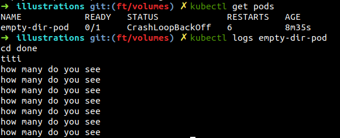

# **Volumes**

## Basics

By default of creation, containers' data storage only exists during the lifetime of its container. Pods and containers, as we've seen, are transient. Therefore, for **preventing any loss of data**, it is crucial to use storage for storing data outside of our container.

Kubernetes creates a object for handling the storage named **Volumes** ; This will prevent for losing data from a pod if the container terminates and allow the next generated container to access the remaining data.

A volume is seen by a pod and its containers as a directory with possibly pre-existed data that are mounted to a specific mountpath.


    - In most situations, it is necessary that data keeps existing even though your pod is terminated, that's possible thanks to a **persistent volume**.
    - Sometimes, you only want to pass parameters to your pod such as config files, passwords or tokens. Two k8s objects exist for doing so the **ConfigMap** and the **secrets**.

NB: A volume is also particularly useful when a container is restarted within a Pod (restartPolicy:always). In that case, any data created by your previous container would remain accessible for the next container whatever the kind of volume you use.

## Volumes Types and Accessibility

Using a volume implies defining it and then claim it from a Pod. We will in this section, describe different type of volumes and how to claim them in a Pod with a yaml.

>*Reminder: for creating an k8s object from a yaml, simply run: kubectl create -f my_k8s_object.yaml*

#### *EmptyDir*

It is a **non-persistent volume**. An empty directory is created in a container and data are written to this shared container directory. As a transient volume, it will be destroyed when the Pod is terminated.

In the following yaml, we will create an empty volume named empty-volume that would create the **/empty** directory on the pod's containter

```
apiVersion: v1
kind: Pod
metadata:
    name: busybox
    namespace: default
spec:
    containers:
    - image: busybox
      name: busy
      command:
        - sleep
        - "3600"
      volumeMounts:
      - mountPath: /empty
        name: empty-volume
    volumes:
    - name: empty-volume
            emptyDir: {}
```

Mounting an emptyDir to two containers inside a pod allows to directly access data from one container to the other. Note that it is not necessary to give the same path on the volumeMounts. If you mount an emptyDir with a non-empty directory inside your pod. it will delete everything. If you need your emptyDir to not be empty, you will need to create the files after the emptyDir creation with a initContainer for example.

```
containers:
  - name: first_cont
    image: busybox
    volumeMounts:
    - mountPath: /first
      name: sharevol
  - name: beta_cont
    image: busybox
    volumeMounts:
    - mountPath: /second
      name: sharevol
  volumes:
  - name: sharevol
    emptyDir: {}
```

#### **EmptyDir - HANDS-ON**

<details>
  <summary>
  Click to access detailed hands on about emptyDir in Pods
  </summary>

  In this first demo, we will create an Empty Dir mounted to a pod. One of the objective is to observe that when the container within the Pod is recreated, he can still access to the data.

  #### 1- Pod creation

  Create a pod from the image *busybox* that will cd to a directory */toto*, do a *ls* of that directory and finally create a file *titi*. Add a sleep of 15 seconds in order to access the container and check the directory toto

  pod_0.yaml
  ```
  apiVersion: v1
  kind: Pod
  metadata:
    name: empty-dir-pod
    labels:
      app: myapp
  spec:
    containers:
    - name: myapp-container
      image: busybox
      command: ['sh', '-c', 'cd /toto && echo cd done && ls /toto && echo "how many do you see" >> titi && cat titi && sleep 15']
  ```

  create your pod:
  > kubectl create -f pod_0.yaml

  

  check if your pods has successfully been deployed:
  > kubectl get pods

  

  As we can see, an error occured while creating our pod. Let's check our logs to figure out what happened:
  > kubectl logs pods empty-dir-pod

  

  The directory *'/toto'* does not exist. let's create an emptyDir that point to *'toto'*.

  #### 2- EmptyDir creation

  We will now delete our pod with the following command for recreating it with an EmptyDir mounted volume.
  > kubectl delete -f pod_0.yaml

  pod_0.yaml
  ```
  apiVersion: v1
  kind: Pod
  metadata:
    name: empty-dir-pod
    labels:
      app: myapp
  spec:
    containers:
    - name: myapp-container
      image: busybox
      command: ['sh', '-c', 'cd /toto && echo cd done && ls /toto && sleep 2 && echo "how many do you see" >> titi && sleep 1 && cat titi && sleep 15']
      volumeMounts:
        - mountPath: /toto
          name: scratch-volume
    volumes:
    - name: scratch-volume
      emptyDir: {}
  ```

  We can now recreate the pod that point to an emptyDir */toto*
  > kubectl create -f pod_0.yaml

  As seen on the Pod section, by default the restartPolicy of a POd is set to always. Therefore, this pod will indefinitely recreate the container. Consequently, he will write to the file titi inside our emptyDir. Let's check our file titi after some recreation of our Pod.

  

  We can see that our pod has restarted 6 times and it's the seventh creation. By checking the logs, we see that *"how many do you see"* is written 7 times !

  Congrats, we've just proved that an EmptyDir is resilient to Container crash and restart.

  #### 3- bonus: Pod lifecycle

  In the last question, we didn't recreate a pod but the container within a specific *empty-dir-pod* pod. Look at the different status of your pod from the creation to the deletion of a container.

  Run several times the following commands:
  > kubectl describe pod empty-dir-pods

  > kubectl get pods

</details>

### *Persistent Volumes (PV) and Persistent Volumes claims (PVC)*

A Persistent Volume is a volume made available within the cluster that will remain available even after containers, pods or nodes restart.

A pod can be linked to this persisten volume by setting up a Persistent Volume Claim (PVC) that defines the parameters requested for the requested volume.

The cluster will then attach a volume that fits all the parameters.

With the following commands, you can check the different PV :
> kubectl get pv

and PVC of your cluster :
> kubectl get pvc

*Example of PV*
```

```

*Example of PVC and use it in a pod*

pvc.yaml
```
kind: PersistentVolumeClaim
apiVersion: v1
metadata:
  name: my-first-pvc
spec:
  resources:
    requests:
      storage: 64M
      accessModes:
        - ReadWriteOnce
```

pod.yaml
```
[...]
containers:
  - name: mongodb
    image: mongo:latest
    volumeMounts:
      - mountPath: "/data/db"
        name: mongo-data
    ports:
      - containerPort: 27017
  volumes:
  - name: my-first-pvc
    persistentVolumeClaim:
      claimName: mongo-disk
```

The storageClassName named managed-premium is  linked to an Azure specific storage type.

##### *lifecycle of persistent storage*

- **Provisioning**, creation of PVs by the administrators or dynamically request ressource.

- **Binding**, when a PVC is created requesting an amount of storage, some access request and sometimes a StorageClass. A matching PV is then located or created by the provisioner if no PV match the PVC.

- **Using**, The volume is now bounded to the Pod for as long as it is needed.

- **Releasing**, Once the PVC is deleted, a PV is made available for another PVC. The data can either be deleted or flushed depending on the persistentVolumeReclaimPolicy set

#### *Access mode*

The access modes are:

    ReadWriteOnce – read-write by a single node
    ReadOnlyMany  – read-only by many nodes
    ReadWriteMany – read-write by many nodes

A Volume can only be mounted using one access mode at a time.

#### *Storage className*

A storage class allow to define the kind of volumes administrators offer and gives a profile of the volumes.

It will at least define the **provisioners** (azure disk, aws ebs, etc.. ), some **parameters** and the **retain policy** for the volumes which can be **Delete** or **Retain** ( A third case exists but is not available for each type of volumes: **Recycle** )

If we'd like as a kubernetes cluster orchestrator, we can create storageClassName in order to restrain the type of volumes some user could use. Here a yaml example for a storageClassname of:

```
apiVersion: storage.k8s.io/v1
kind: StorageClass
metadata:
  name: standard
provisioner: kubernetes.io/gce-pd
parameters:
  type: pd-standard
volumeBindingMode: WaitForFirstConsumer
allowedTopologies:
- matchLabelExpressions:
  - key: failure-domain.beta.kubernetes.io/zone
    values:
    - us-central1-a
    - us-central1-b
```

#### *PV-PVC Bound*

In order to claim for a Persistent Volume, it is important that the PV fills at least all the **requested parameters (capacity, access mode and storageName if one is specified)** of the PVC. It can also **fills more**.

The PV - PVC relationship is a 1-1 meaning that you can't have several PVC mounted with the same PV (respectively the opposite). Yet, it is then possible to use a PVC **in multiple containers** within a pod or inside **several different Pods**.

So for example if a PV can only be access in ReadOnlyMany, he would not be able to be mounted with a PVC which request a ReadWriteOnce as the access mode is more restraining on the PV. Yet, a PVC asking for 90Gi would be mounted with a PV of a capacity of 100Gi.  

### *HostPath*

An existing ressource (commonly the filesystem) of the host node is mounted on the pod. It allows to **persist data**.
It is particularly important to new this type of volume for the certification.

A hostpath can directly be created with a pod **without a PVC** as the following example :

```
apiVersion: v1
kind: Pod
metadata:
  name: test-hostname
spec:
  containers:
  - image: busybox
    name: test-container
    volumeMounts:
    - mountPath: /test-hostname
      name: test-volume
  volumes:
  - name: test-volume
    hostPath:
      path: /data
```

Yet, a hostPath can also be declared as a persistent volume and be used as a classical PVC:

```
kind: PersistentVolume
apiVersion: v1
metadata:
name: hostPathTest
labels:
     type: localStorage
spec:
    capacity:
        storage: 10Gi
    accessModes:
        - ReadWriteOnce
    hostPath:
        path: "/path/data01"
```

Once your volume exists you can claim it within a Pod yaml such as in the following example:

```
...
spec:
    containers:
...
    volumes:
      - name: test-volume
        persistentVolumeClaim:
          claimName: hostPathTest
```

### *PVs list*

Refer to the official documentation if you want to use other type of Volume as a persistentVolume.

https://kubernetes.io/docs/reference/generated/kubernetes-api/v1.18/#persistentvolume-v1-core

#### **PV illustration - HANDS-ON**

<details>
  <summary>
  Click to access detailed hands on about PV & PVC
  </summary>

  In this second demo, we will present the main principe of PV and PVC thanks to an hostPath. It is easier to use as it doesn't make us create a volume thanks to a cloud provider but you can adapt this tutorial to point out to a Disk on Azure/AWS/... if you'd like.

  #### 1- PV creation

  Create an hostname,with a kind of Persistent Volume with the following parameters:
  - storage of 100Mi
  - access mode: ReadWriteOnce
  - points to /tmp/first_hostpath

  pv_1.yaml
  ```
  kind: PersistentVolume
  apiVersion: v1
  metadata:
    name: weblog-pv-volume
  spec:
    storageClassName: manual
    capacity:
      storage: 100Mi
    accessModes:
    - ReadWriteOnce
    hostPath:
      path: "/tmp/first_hostpath"
  ```

  create your pv:
  > kubectl create -f pv_1.yaml

  #### 2- PVC creation

  Create a persistent volume claim with the same parameter than the pv but a storage capacity of 90Mi.

  pvc_1.yaml
  ```
  kind: PersistentVolumeClaim
  apiVersion: v1
  metadata:
    name: weblog-pv-claim
  spec:
    storageClassName: manual
    accessModes:
    - ReadWriteOnce
    resources:
      requests:
        storage: 90Mi
  ```

  create your pvc:
  > kubectl create -f pvc_1.yaml

  You can now check your pv and pvc. you should be able to see that they are bounded to each other. Besides, even though we ask for a claim of 90Mi. The only available PV that meets more than our requirements will be then bounded to our pvc.
  Therefore a pvc that requires few storage could be bounded to a huge pv if it's the only one available. It is therefore important that the k8s cluster administrators provide different type of volumes.
  >kubectl get pv,pvc

  

  #### 3- POD creation

  We will now create a pod with two containers : an nginx application and a fluentd log collector. They will both be mounted to our hostname pvc and write and read from it.

  pod_1.yaml
  ```
  apiVersion: v1
  kind: Pod
  metadata:
    name: hostname-pod
  spec:
    containers:
    - name: fdlogger
      image: fluent/fluentd
      volumeMounts:
      - mountPath: "/var/log"
        name: hostname-pv-storage
    - name: webcont
      image: nginx
      ports:
      - containerPort: 80
      volumeMounts:
      - mountPath: "/var/log/nginx/"
        name: hostname-pv-storage
    volumes:
    - name: hostname-pv-storage
      persistentVolumeClaim:
        claimName: weblog-pv-claim
  ```

  create your pod:
  > kubectl create -f pod_1.yaml

  Verify the states of your pod.

  #### 4- hostname verification

  We need now to check if an hostname has been created in the directory /tmp of our node. As we are using minikube, we need to connect to the minikube cluster instance.

  > minikube ssh

  inside the minikube node, check the tmp/first_hostpath and look at its content.

  We can now curl the nginx instance in order to write inside our /var/log/nginx of our container which is mounted with our hostpath and should therefore write as well on it.

  We need to find out in which IP address we have to curl as we didn't expose our pod with a service.
  > kubectl get pods -o wide

  we can now curl from our minikube cluster to the IP of our pod. In our case, 172.17.0.2 and see that a request log has been added to our access.log hostpath.
  > curl 172.17.0.2

</details>
