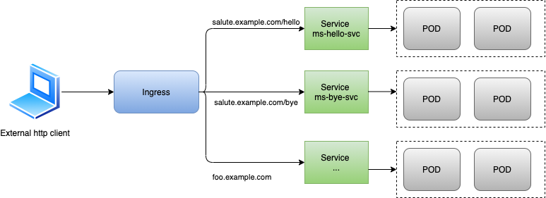
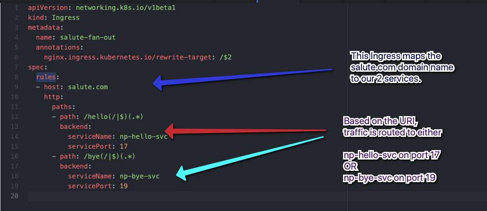
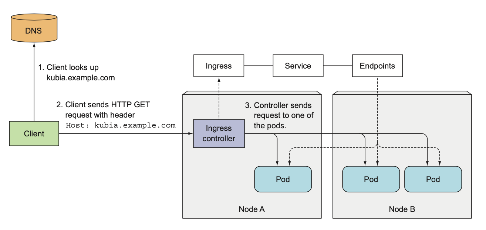

# Ingress


* [Introduction](#Introduction)
  * [Dummy Application](#Dummy-Application)
  * [Overview](#Overview)
  * [Vocation](#Vocation)
* [Core Components](#Core-components)
  * [Ingress Controller](#Ingress-Controller)
  * [Ingress Resource](#Ingress-Resource)
* [Ingress Resources](#Types-of-Ingress-Resources)
  * [Options](#Options) FQDN vs Ip, Public vs Private, rewriting, default backend ...
  * [Fanout](#Fanout)
* [Ingress Deployment](#Ingress-Deployment)
  * [Minikube Addon](#Minikube-Addon)
  * [Helm Charts](#Helm-Charts)
  * [Bare Deployment](#Bare-Deployment) ?? TODO find another name to describe traeffik ingress controller deployment which includes SA, Cluster Role, ClusterRole Binding, Network Policy, Daemonset, Service
* [TLS](#TLS)
  * [Static Certificate](#Static-Certificate) self signed or trusted authority
  * [Dynamic Certificate](#Dynamic-Certificate)  Cert-Manager, Letsencrypt
* [Authentication](#Authentication)
  * [Basic](#Basic)
  * [Oauth](#Oauth)
  * [AD](#AD)

This is a paragraph that for some reason we want blue.
{: .blue}

## Introduction


### Dummy Application

Before diving into ingress topics, let's remind the dummy applications used to illustrate the theoretical concepts.
We use the same node.js simple micro services (**[node.js applications](../docker-images/node-app/svc-section/)** )
- ms-hello

```
/*
* Server definition
* */
const PORT = 7777;
const HOST = '0.0.0.0';
app.use(bodyParser.json());
app.use(logger("combined"));
app.listen(PORT, HOST);
console.log(`Running on http://${HOST}:${PORT}`);
/*
monitor(function (event) {
      console.log('Log event: ', event);
});
*/


/*
* Route definition
* */

app.get('/', function(req, res) {

    res.send('This is the hello world from ms hello')
});

app.get('/sayHelloToSomeone', function(req, res) {

    var msg={personToSayHello: req.query.personToSalute}
    res.send(msg);
});
```
- ms-bye

```
/*
* Server definition
* */
const PORT = 9999;
const HOST = '0.0.0.0';
app.use(bodyParser.json());
app.use(logger("combined"));
app.listen(PORT, HOST);
console.log(`Running on http://${HOST}:${PORT}`);

/*
* Route definition
* */

app.get('/', function(req, res) {
    console.log("testBye MS + root")
    res.send('This is the root of ms bye')
});

app.get('/sayByeToSomeone', function(req, res) {

    var msg={personToSayBye: req.query.personToSalute}
    res.send(msg);
});
```

In the chapter dedicated to services, we exposed those deployments to the external world though nodePort Services.
Refresher on NodePort services:
>A NodePort service is the most primitive way to get external traffic directly to your service.
NodePort, as the name implies,
- opens a specific high port on all the Nodes (the VMs) <-> [30000;32000[
- automatically creates ClusterIP Service, to which the NodePort Service routes
- service is accessible from outside via <NodeIP>:<NodePort>
- and any traffic that is sent to this port is forwarded (reverse proxied) to the cluster internal service (ClusterIp)

Let's build up the initial building blocks of our dummy application. First let's clean up the default namespace, but DO NOT delete kubernetes service.
The following commands will
- delete within default namespace all deployments, pods, replica sets.
- delete all services apart from default namespace

```
kubectl delete deploy,rs,po --all -n default
kubectl delete svc --field-selector metadata.name!=kubernetes -n default
```

Then we  
- create 2 deployments "ms-hello-dep" and "ms-bye-dep"
- expose them via node port services

```
kubectl apply -f illustrations/basic_ms/ms-bye-dep.yaml
kubectl apply -f illustrations/basic_ms/ms-hello-dep.yaml
kubectl apply -f illustrations/basic_ms/nodeport-bye-svc.yaml
kubectl apply -f illustrations/basic_ms/nodeport-hello-svc.yaml
```

As a result, we end up with following objects created in our k8s cluster within the default namespace:

> kubectl get deploy,rs,po,svc,ep -o wide --show-labels

```
NAME                           READY   UP-TO-DATE   AVAILABLE   AGE     CONTAINERS   IMAGES                SELECTOR            LABELS
deployment.apps/ms-bye-dep     2/2     2            2           3m6s    ms-bye       pgolard/ms-bye:v5     app=ms-bye-pods     app=ms-bye-dep
deployment.apps/ms-hello-dep   2/2     2            2           2m57s   ms-hello     pgolard/ms-hello:v5   app=ms-hello-pods   app=ms-hello-dep

NAME                                      DESIRED   CURRENT   READY   AGE     CONTAINERS   IMAGES                SELECTOR                                         LABELS
replicaset.apps/ms-bye-dep-5c6ff967       2         2         2       3m6s    ms-bye       pgolard/ms-bye:v5     app=ms-bye-pods,pod-template-hash=5c6ff967       app=ms-bye-pods,pod-template-hash=5c6ff967
replicaset.apps/ms-hello-dep-7fdf6cb86c   2         2         2       2m57s   ms-hello     pgolard/ms-hello:v5   app=ms-hello-pods,pod-template-hash=7fdf6cb86c   app=ms-hello-pods,pod-template-hash=7fdf6cb86c

NAME                                READY   STATUS    RESTARTS   AGE     IP           NODE       NOMINATED NODE   READINESS GATES   LABELS
pod/ms-bye-dep-5c6ff967-9qpn8       1/1     Running   0          3m5s    172.17.0.3   minikube   <none>           <none>            app=ms-bye-pods,pod-template-hash=5c6ff967
pod/ms-bye-dep-5c6ff967-d4hmb       1/1     Running   0          3m6s    172.17.0.2   minikube   <none>           <none>            app=ms-bye-pods,pod-template-hash=5c6ff967
pod/ms-hello-dep-7fdf6cb86c-jvh7w   1/1     Running   0          2m57s   172.17.0.5   minikube   <none>           <none>            app=ms-hello-pods,pod-template-hash=7fdf6cb86c
pod/ms-hello-dep-7fdf6cb86c-ztv4c   1/1     Running   0          2m57s   172.17.0.4   minikube   <none>           <none>            app=ms-hello-pods,pod-template-hash=7fdf6cb86c

NAME                   TYPE        CLUSTER-IP     EXTERNAL-IP   PORT(S)        AGE     SELECTOR            LABELS
service/kubernetes     ClusterIP   10.96.0.1      <none>        443/TCP        122d    <none>              component=apiserver,provider=kubernetes
service/np-bye-svc     NodePort    10.96.47.122   <none>        19:32000/TCP   2m52s   app=ms-bye-pods     app=ms-bye-dep
service/np-hello-svc   NodePort    10.96.41.73    <none>        17:31000/TCP   2m46s   app=ms-hello-pods   app=ms-hello-dep

NAME                     ENDPOINTS                         AGE     LABELS
endpoints/kubernetes     192.168.64.7:8443                 122d    <none>
endpoints/np-bye-svc     172.17.0.2:9999,172.17.0.3:9999   2m52s   app=ms-bye-dep
endpoints/np-hello-svc   172.17.0.4:7777,172.17.0.5:7777   2m46s   app=ms-hello-dep
```

Now let's test our nodeport services. First we try "np-hello-svc" by making an HTTP request on minikube ip (Node "public" Ip) on the high port "31000"
- which reverse proxies to "np-bye-svc" clusterIp on service port "17"
- which then forwards request to container port "7777"

```
nodeIp=$(minikube ip)

curl -X GET http://$nodeIp:31000/sayHelloToSomeone?personToSalute=Joe

{"personToSayHello":"Joe"}%
```

We make similar query to test "np-bye-svc":

```
nodeIp=$(minikube ip)

curl -X GET http://$nodeIp:32000/sayByeToSomeone\?personToSalute\=sleepy

{"personToSayBye":"sleepy"}%
```

### Overview

We've just seen in our dummy application a way to expose a service to the external world, namely by deploying a NodePort service.
The caveat of exposing your services through NodePort is that your service ip is tied (are tied if multiple nodes) to your cluster nodes public ip. In addition to that you end up with one High Port per NodePort service.

We saw in the chapter dedicated to "Services" that there was another option, the LoadBalancer.
Small reminder on LoadBalancer:

> It Exposes the Service externally using a cloud provider's load balancer that provides a **single IP** which distributes requests to all our **external nodes IPs**.
**NodePort and ClusterIP Services**, to which the external load balancer routes traffic, are automatically created.
All a LoadBalancer service does is
- it creates a NodePort service.
- it sends a message to the provider who hosts the Kubernetes cluster asking for a loadbalancer to be setup pointing to all external node IPs and specific nodePort.
Every Service that you deploy as LoadBalancer will get it’s own IP (The LoadBalancer is usually billed based on the number of exposed services, which can be expensive).


You’ve now seen two ways of exposing a service to clients outside the cluster, but another method exists: **creating an Ingress resource**.

An ingress is a "service for services".
It consists of a kind of gateway between outside world and your k8s apps running on your minions.

Ingresses actually re-route traffic from/to the outside world to your svc (and their final endpoints, namely our dep/RC/pods).


### Vocation


One important reason is that each LoadBalancer service requires its own load bal- ancer with its own public IP address, whereas an Ingress only requires one, even when providing access to dozens of services.
When a client sends an HTTP request to the Ingress, the host and path in the request determine which service the request is forwarded to.




Ingresses operate at the application layer of the network stack (HTTP) and can provide features such as cookie-based session affinity and the like, which services can't.


## Core Components

Normally, an ingress includes three components:
- ingress "controllers" (not controllers in k8s vocabulary but pods created through deployments or daemonsets) that handle traffic
- ingress svc (virtual ip that points towards ing controllers) -> **??????**
- ingress rules : instructions that ingress "controllers" have to implement to redirect traffic to appropriate micro services

### Ingress Controller

In order to make Ingress resources work (in order to apply some ingress rules/features), an Ingress controller needs to be running in the cluster.
Different Kubernetes environments use different implementations of the controller, but several don’t provide a default controller at all.

Later on in this chapter, within the section dedicated to "Ingress Deployment", we'll dive deeper in the exact components and subcomponents an Ingress Controller is made up of/is interacting with.
For now on, let's focus on the fact a set of pods needs to be deployed to handle traffic and apply the Ingress resource/rules we're going to define.
As this training is mostly relying on minikube, let's quickly see how the ingress controller can be deployed on minikube. To do so, you just need to enable the following addon:


```
minikube addons enable ingress
```

We now see in the kube-system namespace that a "nginx-ingress-controller-6fc5bcc8c9-286c6" pod has just been created.

> kubectl get pods -n kube-system

```
NAME                                        READY   STATUS    RESTARTS   AGE
coredns-6955765f44-b6z8t                    1/1     Running   1          19d
coredns-6955765f44-nklm8                    1/1     Running   1          19d
etcd-minikube                               1/1     Running   16         199d
kube-addon-manager-minikube                 1/1     Running   9          199d
kube-apiserver-minikube                     1/1     Running   81         199d
kube-controller-manager-minikube            1/1     Running   290        199d
kube-proxy-d9vbc                            1/1     Running   9          199d
kube-scheduler-minikube                     1/1     Running   282        199d
metrics-server-6754dbc9df-nhjbx             1/1     Running   1          19d
nginx-ingress-controller-6fc5bcc8c9-286c6   1/1     Running   18         19s
storage-provisioner                         1/1     Running   2          14d
```

This is the Ingress controller pod. The name suggests that Nginx (an open-source HTTP server and reverse proxy) is used to provide the Ingress functionality.

We'll get back on the Ingress Controller laetr on in this chapter.

### Ingress Resource

You’ve confirmed there’s an Ingress controller running in your cluster, so you can now create an Ingress resource.
There are several ways of defining Ingress resources, with different options.
We're going to deep dive in that in next section.
For now on, let's see a simple example of Ingress resource. The following YAML manifest for an fanout Ingress looks like.



A fanout configuration routes traffic from a single IP address to more than one Service, based on the HTTP URI being requested. An Ingress allows you to keep the number of load balancers down to a minimum.

Note that we used the NodePort Services as backends. Nevertheless traffic will be forwarded to services clusterIp since we route traffic to service Port, not to NodePort.
```
kubectl apply -f illustrations/ingress_rules/saluteing.yaml
nodeIp=$(minikube ip)
curl -H "Host: salute.com" -X GET http://$nodeIp/hello/

This is the hello world from ms hello%                                                                                                                                                                               

curl -H "Host: salute.com" -X GET http://$nodeIp/hello/sayHelloToSomeone\?personToSalute\=Joe


{"personToSayHello":"Joe"}%


curl -H "Host: salute.com" -X GET http://$nodeIp/bye/sayByeToSomeone\?personToSalute\=Sleepy

{"personToSayBye":"Sleepy"}%
```

In next scetion we'll see in details the different types of ingress resources that can be defined.

FOR THE REST OF THE CHAPTER See
https://kubernetes.io/docs/concepts/services-networking/ingress/


Configure mutual TLS authentication

https://www.alibabacloud.com/help/doc-detail/86533.htm

use

edit and adapt to fanout

---


on a proper k8s instances (as a service or not), an ingress is a "service for services".
It consists of a kind of gateway between outside world and your k8s apps running on your minions.

Ingresses actually re-route traffic from/to the outside world to your svc (and their final endpoints, namely our dep/RC/pods).

Normally, an ingress includes three components:
- ingress "controllers" (not controllers in k8s vocabulary but pods created through deployments or daemonsets) that handle traffic
- ingress svc (virtual ip that points towards ing controllers)
- ingress rules : instructions that ingress "controllers" have to implement to redirect traffic to appropriate micro services


There are different ways to set up ingresses, according to the k8s "distribution"
- helm - pkg mgr
- dameonsets + svc + svc account + roles + rolebindings
- minikube simple command : minikube addons enable ingress

The strange thing with minikube is that the simple command (addons...)
- generate a "controller" in kube-system ns
- do not generate a dedicated ingress svc

Below is the list of items in all namespaces

`kubectl get po,svc,ing --all-namespaces`


```
NAMESPACE     NAME                                            READY   STATUS    RESTARTS   AGE
default       pod/ciro-59ffbfbf4f-s8j4v                       1/1     Running   0          3h1m
default       pod/ciro-59ffbfbf4f-th5dt                       1/1     Running   0          3h1m
default       pod/savastano-79b985b446-4zzxj                  1/1     Running   0          3h42m
default       pod/savastano-79b985b446-rp8xd                  1/1     Running   0          3h42m
kube-system   pod/coredns-6955765f44-dzr5w                    1/1     Running   1          39d
kube-system   pod/coredns-6955765f44-q66nc                    1/1     Running   1          39d
kube-system   pod/etcd-minikube                               1/1     Running   1          39d
kube-system   pod/kube-addon-manager-minikube                 1/1     Running   1          39d
kube-system   pod/kube-apiserver-minikube                     1/1     Running   1          39d
kube-system   pod/kube-controller-manager-minikube            1/1     Running   2          39d
kube-system   pod/kube-proxy-d9vbc                            1/1     Running   1          39d
kube-system   pod/kube-scheduler-minikube                     1/1     Running   2          39d
kube-system   pod/nginx-ingress-controller-6fc5bcc8c9-95kfd   1/1     Running   2          39d
kube-system   pod/storage-provisioner                         1/1     Running   1          39d

NAMESPACE     NAME                              TYPE        CLUSTER-IP      EXTERNAL-IP   PORT(S)                  AGE
default       service/ciro-svc-clusterip        ClusterIP   10.96.56.66     <none>        7777/TCP                 64m
default       service/kubernetes                ClusterIP   10.96.0.1       <none>        443/TCP                  39d
default       service/savastano-svc-clusterip   ClusterIP   10.96.200.187   <none>        9999/TCP                 63m
kube-system   service/kube-dns                  ClusterIP   10.96.0.10      <none>        53/UDP,53/TCP,9153/TCP   39d

NAMESPACE   NAME                                 HOSTS         ADDRESS        PORTS   AGE
default     ingress.extensions/fan-out-ingress   gomorra.com   192.168.64.7   80      61m
```

Nevertheless, when you apply ingress rules, it works.


Here is the ingress rule:
```
apiVersion: networking.k8s.io/v1beta1
kind: Ingress
metadata:
  name: fan-out-ingress
  annotations:
    nginx.ingress.kubernetes.io/rewrite-target: /$2
spec:
  rules:
  - host: gomorra.com
    http:
      paths:
      - path: /donciro(/|$)(.*)
        backend:
          serviceName: ciro-svc-clusterip
          servicePort: 7777
      - path: /donpietro(/|$)(.*)
        backend:
          serviceName: savastano-svc-clusterip
          servicePort: 9999

```
Now you can access your MS from outside the cluster without being bound the NodePort.
>minikubeIp=$(minikube ip)

> curl -H "Host: gomorra.com" -X GET http://$minikubeIp/donciro/


## check theory
https://kubernetes.io/docs/concepts/services-networking/ingress/#tls

TODO CHECK sessionAffinity FOR WEBAPPS
https://medium.com/@zhimin.wen/sticky-sessions-in-kubernetes-56eb0e8f257d
https://www.haproxy.com/blog/load-balancing-affinity-persistence-sticky-sessions-what-you-need-to-know/


## ssl
Check the ssl stuff
Here we see that we do not provide host name with that ingress :

```
apiVersion: networking.k8s.io/v1beta1
kind: Ingress
metadata:
  name: fan-out-ingress-clusterip
  annotations:
    nginx.ingress.kubernetes.io/ssl-redirect: \"false\"
    nginx.ingress.kubernetes.io/rewrite-target: /$2
spec:
  rules:
  - http:
      paths:
      - path: /donciro(/|$)(.*)
        backend:
          serviceName: web-service-ciro
          servicePort: 7777
      - path: /donpietro(/|$)(.*)
        backend:
          serviceName: web-service-savastano
          servicePort: 9999
```


## Ingess single svc

```
apiVersion: networking.k8s.io/v1beta1
kind: Ingress
metadata:
  name: test-ingress
spec:
  backend:
    serviceName: testsvc
    servicePort: 80
```

## auth

https://medium.com/@ankit.wal/authenticate-requests-to-apps-on-kubernetes-using-nginx-ingress-and-an-authservice-37bf189670ee


## session affinity for web app

https://www.haproxy.com/blog/load-balancing-affinity-persistence-sticky-sessions-what-you-need-to-know/


---

## MINIKUBE SPECIFICITY WITH INGRESS

on a proper k8s instances (as a service or not), an ingress is a "service for services".
It consists of a kind of gateway between outside world and your k8s apps running on your minions.

Ingresses actually re-route traffic from/to the outside world to your svc (and their final endpoints, namely our dep/RC/pods).

Normally, an ingress includes three components:
- ingress "controllers" (not controllers in the k8s vocabulary; actually pods - created through deployments or daemonsets) that
- ingress svc (virtual ip that points towards ing controllers)
- ingress rules : instructions that ingress "controllers" have to implement to redirect traffic to appropriate micro services

There are different ways to set up ingresses, according to the k8s "distribution"
- helm - pkg mgr
- dameonsets + svc + svc account + roles + rolebindings
- minikube simple command : minikube addons enable ingress

The strange thing with minikube is that the simple command (addons...)
- generate a "controller" in kube-system ns
- do not generate a dedicated ingress svc

Nevertheless, when you apply ingress rules, it works.


## minikube

advanced ingress with certificates
https://hackernoon.com/setting-up-nginx-ingress-on-kubernetes-2b733d8d2f45
https://skryvets.com/blog/2019/04/09/exposing-tcp-and-udp-services-via-ingress-on-minikube/
https://kubeless.io/docs/http-triggers/

## NGINX INGRESS SETUP - with different k8s tools

https://kubernetes.github.io/ingress-nginx/deploy/

#### ingress fan out minikube accessible from any machine in your home network

## Create Ingress

Important to note that this simple command creates automatically in ns kube-system
- niginx ingress controller (pod in charge of routing traffic)
- DO NOT create an ingress service as it would with AKS, prod k8s or Docker for mac

> minikube addons enable ingress
> kubectl get pods --all-namespaces

Now let's create an ingress rule that the ingress "controller" will have to implement:

> kubectl create -f virtual-hosts-ingress.yaml

Check ingress rule creation:

> kubectl get ing

Now test requesting a microservice using host fake dns as IP, and do not make the effort of specifying the port (or specify port 80, which the nginx ingress default port for http)
In this example the real IP is minikube's.

> curl -H "Host: gomorra.com" -X GET http://192.168.64.5/donpietro/

## Port forward your ingress to make it accessible in your LAN

> ssh -i ~/.minikube/machines/minikube/id_rsa docker@$(minikube ip) -L \*:80:0.0.0.0:80

After svc port fwd => use host ip. You can do this from any machine in your LAN.

> curl -H "Host: gomorra.com" -X GET http://192.168.0.6:80/donciro/\n
> curl -H "Host: gomorra.com" -X GET http://192.168.0.6:80/donciro/getImmortale/\n


## useful network commands to scan network
telnet

netstat
9244  arp -a
 9245  brew install arp-scan
 9246  arp-scan --localnet\n
 9412  arp -a
 9414  arp -a
 9416  brew install arp-scan
 9417  arp-scan -l
 9418  sudo arp-scan -l
10090  history | grep arp
10091  arp-scan -l
10092  sudo arp-scan -l
10095  arp -a
10100  arp -a
