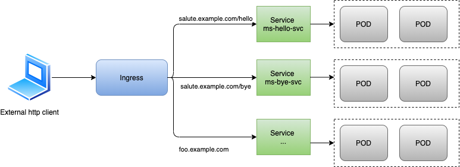

# Introduction (Ingress)


## Dummy Application

Before diving into ingress topics, let's remind the dummy applications used to illustrate the theoretical concepts.
We use the same node.js simple micro services (**[node.js applications](../docker-images/node-app/svc-section/)**)

- ms-hello

```javascript
/*
* Server definition
* */
const PORT = 7777;
const HOST = '0.0.0.0';
app.use(bodyParser.json());
app.use(logger("combined"));
app.listen(PORT, HOST);
console.log(`Running on http://${HOST}:${PORT}`);
/*
monitor(function (event) {
      console.log('Log event: ', event);
});
*/


/*
* Route definition
* */

app.get('/', function(req, res) {

    res.send('This is the hello world from ms hello')
});

app.get('/sayHelloToSomeone', function(req, res) {

    var msg={personToSayHello: req.query.personToSalute}
    res.send(msg);
});
```

- ms-bye

```javascript
/*
* Server definition
* */
const PORT = 9999;
const HOST = '0.0.0.0';
app.use(bodyParser.json());
app.use(logger("combined"));
app.listen(PORT, HOST);
console.log(`Running on http://${HOST}:${PORT}`);

/*
* Route definition
* */

app.get('/', function(req, res) {
    console.log("testBye MS + root")
    res.send('This is the root of ms bye')
});

app.get('/sayByeToSomeone', function(req, res) {

    var msg={personToSayBye: req.query.personToSalute}
    res.send(msg);
});
```

In the chapter dedicated to services, we exposed those deployments to the external world though nodePort Services.
Refresher on NodePort services:
>A NodePort service is the most primitive way to get external traffic directly to your service.
NodePort, as the name implies,
- opens a specific high port on all the Nodes (the VMs) <-> [30000;32000[
- automatically creates ClusterIP Service, to which the NodePort Service routes
- service is accessible from outside via <NodeIP>:<NodePort>
- and any traffic that is sent to this port is forwarded (reverse proxied) to the cluster internal service (ClusterIp)

Let's build up the initial building blocks of our dummy application. First let's clean up the default namespace, but DO NOT delete kubernetes service.
The following commands will
- delete within default namespace all deployments, pods, replica sets.
- delete all services apart from default namespace

```
kubectl delete deploy,rs,po --all -n default
kubectl delete svc --field-selector metadata.name!=kubernetes -n default
```

Then we  
- create 2 deployments "ms-hello-dep" and "ms-bye-dep"
- expose them via node port services

```
kubectl apply -f illustrations/basic_ms/ms-bye-dep.yaml
kubectl apply -f illustrations/basic_ms/ms-hello-dep.yaml
kubectl apply -f illustrations/basic_ms/nodeport-bye-svc.yaml
kubectl apply -f illustrations/basic_ms/nodeport-hello-svc.yaml
```

As a result, we end up with following objects created in our k8s cluster within the default namespace:

> kubectl get deploy,rs,po,svc,ep -o wide --show-labels
```
NAME                           READY   UP-TO-DATE   AVAILABLE   AGE     CONTAINERS   IMAGES                SELECTOR            LABELS
deployment.apps/ms-bye-dep     2/2     2            2           3m6s    ms-bye       pgolard/ms-bye:v5     app=ms-bye-pods     app=ms-bye-dep
deployment.apps/ms-hello-dep   2/2     2            2           2m57s   ms-hello     pgolard/ms-hello:v5   app=ms-hello-pods   app=ms-hello-dep
NAME                                      DESIRED   CURRENT   READY   AGE     CONTAINERS   IMAGES                SELECTOR                                         LABELS
replicaset.apps/ms-bye-dep-5c6ff967       2         2         2       3m6s    ms-bye       pgolard/ms-bye:v5     app=ms-bye-pods,pod-template-hash=5c6ff967       app=ms-bye-pods,pod-template-hash=5c6ff967
replicaset.apps/ms-hello-dep-7fdf6cb86c   2         2         2       2m57s   ms-hello     pgolard/ms-hello:v5   app=ms-hello-pods,pod-template-hash=7fdf6cb86c   app=ms-hello-pods,pod-template-hash=7fdf6cb86c
NAME                                READY   STATUS    RESTARTS   AGE     IP           NODE       NOMINATED NODE   READINESS GATES   LABELS
pod/ms-bye-dep-5c6ff967-9qpn8       1/1     Running   0          3m5s    172.17.0.3   minikube   <none>           <none>            app=ms-bye-pods,pod-template-hash=5c6ff967
pod/ms-bye-dep-5c6ff967-d4hmb       1/1     Running   0          3m6s    172.17.0.2   minikube   <none>           <none>            app=ms-bye-pods,pod-template-hash=5c6ff967
pod/ms-hello-dep-7fdf6cb86c-jvh7w   1/1     Running   0          2m57s   172.17.0.5   minikube   <none>           <none>            app=ms-hello-pods,pod-template-hash=7fdf6cb86c
pod/ms-hello-dep-7fdf6cb86c-ztv4c   1/1     Running   0          2m57s   172.17.0.4   minikube   <none>           <none>            app=ms-hello-pods,pod-template-hash=7fdf6cb86c
NAME                   TYPE        CLUSTER-IP     EXTERNAL-IP   PORT(S)        AGE     SELECTOR            LABELS
service/kubernetes     ClusterIP   10.96.0.1      <none>        443/TCP        122d    <none>              component=apiserver,provider=kubernetes
service/np-bye-svc     NodePort    10.96.47.122   <none>        19:32000/TCP   2m52s   app=ms-bye-pods     app=ms-bye-dep
service/np-hello-svc   NodePort    10.96.41.73    <none>        17:31000/TCP   2m46s   app=ms-hello-pods   app=ms-hello-dep
NAME                     ENDPOINTS                         AGE     LABELS
endpoints/kubernetes     192.168.64.7:8443                 122d    <none>
endpoints/np-bye-svc     172.17.0.2:9999,172.17.0.3:9999   2m52s   app=ms-bye-dep
endpoints/np-hello-svc   172.17.0.4:7777,172.17.0.5:7777   2m46s   app=ms-hello-dep
```

Now let's test our nodeport services. First we try "np-hello-svc" by making an HTTP request on minikube ip (Node "public" Ip) on the high port "31000"
- which reverse proxies to "np-bye-svc" clusterIp on service port "17"
- which then forwards request to container port "7777"
> nodeIp=$(minikube ip)
```javascript
curl -X GET http://$nodeIp:31000/sayHelloToSomeone?personToSalute=Joe

{"personToSayHello":"Joe"}%
```

We make similar query to test "np-bye-svc":

```javascript

curl -X GET http://$nodeIp:32000/sayByeToSomeone\?personToSalute\=sleepy

{"personToSayBye":"sleepy"}%
```

## Overview

We've just seen in our dummy application a way to expose a service to the external world, namely by deploying a NodePort service.
The caveat of exposing your services through NodePort is that your service ip is tied (are tied if multiple nodes) to your cluster nodes public ip. In addition to that you end up with one High Port per NodePort service.

We saw in the chapter dedicated to "Services" that there was another option, the LoadBalancer.
Small reminder on LoadBalancer:

> It Exposes the Service externally using a cloud provider's load balancer that provides a **single IP** which distributes requests to all our **external nodes IPs**.
**NodePort and ClusterIP Services**, to which the external load balancer routes traffic, are automatically created.
All a LoadBalancer service does is
- it creates a NodePort service.
- it sends a message to the provider who hosts the Kubernetes cluster asking for a loadbalancer to be setup pointing to all external node IPs and specific nodePort.
Every Service that you deploy as LoadBalancer will get it’s own IP (The LoadBalancer is usually billed based on the number of exposed services, which can be expensive).


You’ve now seen two ways of exposing a service to clients outside the cluster, but another method exists: **creating an Ingress resource**.

An ingress is a "service for services".
It consists of a kind of gateway between outside world and your k8s apps running on your minions.

Ingresses actually re-route traffic from/to the outside world to your svc (and their final endpoints, namely our dep/RC/pods).


## Vocation


One important reason is that each LoadBalancer service requires its own load bal- ancer with its own public IP address, whereas an Ingress only requires one, even when providing access to dozens of services.
When a client sends an HTTP request to the Ingress, the host and path in the request determine which service the request is forwarded to.




Ingresses operate at the application layer of the network stack (HTTP) and can provide features such as cookie-based session affinity and the like, which services can't.


back to ingress home **[:arrow_left:](ingress.md)**
**[:arrow_right:](core-comp.md)** next section core components
