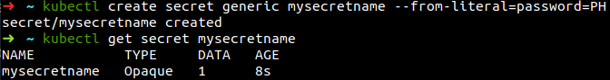
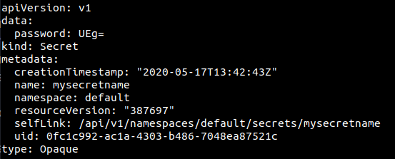

# **Secrets and configMaps**

Those two objects are quite close in k8s and allow us to not store configurations data in our source code. Besides, it will ease the change of a deployment's configuration without deployed it again.


## Secrets

Secrets in k8s is by default **base64-encoded but not encrypted**. You can create as many secrets as you want that will be stored **within a file** that can then be used as an **environment variable** or as a **directory like a volume**. There is a limit of 1MB for the secret and as each secret is stored as an API object, a very large numbers of secrets might deplete memory of a host.

Secrets are stored in the tmpfs storage of the host node and are only sent to the host running Pod. it is really important that the secret exist and then be mounted with a Pod before being requested.

### *Creation*

They are different way of creating a secret:

#### *command-line:*
> kubectl create secret generic mySecretName --from-literal=password=test



Let's check it:



We can observe that the literal is stored as a key:value type within the data section. The value in our case *PH* has been base64-encoded and see where it has been stored within our k8s API objects

#### *yaml file:*
Let's first find the base64-encoded version of "test"

```
apiVersion: v1
kind: Secret
metadata:
  name: mysecretname
data:
  password: UEg=
```
> kubectl create -f mysecret.yaml

### *Use secrets in POD*

#### *via Environment Variable*

```
[...]
spec:
  containers:
  - image: busybox
    name: firstpod
    command:
      - sleep
      - "3600"
    env:
    - name: MY_PASSWORD
      valueFrom:
        secretKeyRef:
          name: mysecretname
          key: password
```

Inside the secretKeyRef, we precise the name of the secret we previously create and the key we would like to access.

#### *via Volume mount*

```
apiVersion: v1
kind: Pod
metadata:
  name: secret-pod
spec:
  containers:
  - image: busybox
    name: firstpod
    command:
      - sleep
      - "3600"
    volumeMounts:
    - mountPath: /mypodpassword
      name: mysecretvol
    volumes:
    - name: mysecretvol
      secret:
        secretName: mysecretname
```

You can otherwise define your secret as a volume.

### *ConfigMap*

A key-value dictionary loaded by your container at runtime. It's a mean of injecting external configuration to a Pod.
Pods can consume configMap as environmental variables, command-line args or in volumes. A pod would not be able to run if it refers to a ConfigMap that doesn't exist yet.

```
kind: ConfigMap
apiVersion: v1
metadata:
  name: appconfig
data:
  LOG_LEVEL: info
  config.ini: |
    foo=bar
    var=abc
    var2=xyz
```

We have on the previous example two examples of key-value relationship for our configMap; either a simple value for the LOG_LEVEL or as a file-like keys with the config.ini.

It is also possible to create a configMap from command-line:
> kubectl create configmap appconfig --from-file=config-file

or from an env-file:
> kubectl create configmap appconfig --from-env-file=config-file.properties

or from litteral:
> kubectl create configmap appconfig --from-literal=key.example=test

There are different ways of accessing those key-value inside a pod.

#### configMap as a volumes

```
apiVersion: v1
kind: Pod
metadata:
  name: mypod
spec:
  containers:
  - name: mypod
    image: redis
    volumeMounts:
    - name: foo
      mountPath: "/etc/foo"
      readOnly: true
  volumes:
  - name: foo
    configMap:
      name: appconfig
```

When a config map is updated, the keys are also updated. It is possible to add an immutable parameter in the yaml so that the kube-apiserver stop watch the configmap marked as immutable.

You can also decide to only access a certain key-value pair in the config map and a path too:
```
volumes:
    - name: config-volume
      configMap:
        name: special-config
        items:
        - key: LOG_LEVEL
          path: keys
```

With the two previous example combined, we will find **'info'** written in /etc/foo/keys

#### configMap as a Pod environment variable

```
apiVersion: v1
kind: Pod
metadata:
  name: dapi-test-pod
spec:
  containers:
    - name: test-container
      image: k8s.gcr.io/busybox
      command: [ "/bin/sh", "-c", "env" ]
      env:
        # Define the environment variable
        - name: SPECIAL_LEVEL_KEY
          valueFrom:
            configMapKeyRef:
              # The ConfigMap containing the value you want to assign to SPECIAL_LEVEL_KEY
              name: appconfig
              # Specify the key associated with the value
              key: config.ini.foo
  restartPolicy: Never
  ```

#### configMap as a Container environment variables

```
apiVersion: v1
kind: Pod
metadata:
  name: dapi-test-pod
spec:
  containers:
    - name: test-container
      image: k8s.gcr.io/busybox
      command: [ "/bin/sh", "-c", "env" ]
      envFrom:
      - configMapRef:
          name: appconfig
  restartPolicy: Never
```
